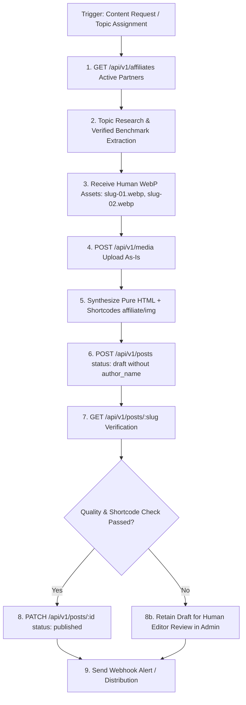

# StackYup CMS — Autonomous AI Agent Integration & Protocol Specification
> **Document Version:** 2.1 (Enterprise Spec)  
> **Target Systems:** Muse AI, Hermes Agent, OpenClaw, Claude Desktop MCP, AutoGen, CrewAI, LangChain, Cursor / Windsurf  
> **API Version:** v1 (`/api/v1`)  
> **Spec Conformance:** RESTful, OpenAPI 3.1, Model Context Protocol (MCP)

---

### Specification Changelog (v2.0 → v2.1)

- **Decoupled 3-Tier Author Resolution:** Eliminated hardcoded `author_name` defaults (`"Adit"`) from the specification, tool schemas, and sample payloads. The CMS now implements a dynamic 3-tier author resolution model: (1) Request `author_name` override if explicitly specified by an operator, (2) Centralized `default_author_name` configured in CMS Site Settings, (3) Server fallback. By default, **AI agents do not send `author_name`**, allowing site administrators to adjust pen names or editorial bylines without editing prompts or integration specifications. Added `GET /api/v1/settings` endpoint.
- **Automated Affiliate Disclosure:** Eliminated manual disclosure paragraph writing by AI agents. StackYup CMS automatically injects and renders the FTC-compliant disclosure box whenever affiliate shortcodes are detected in the article body. Manual disclosure paragraphs are strictly prohibited to prevent duplicate disclosure bugs.
- **Affiliate Shortcode Standard (`[affiliate]`):** Deprecated raw HTML `<a href="...">` affiliate links. All commercial and partner references must use `[affiliate id="..."]` or `[affiliate id="..." text="..."]`. The CMS dynamically expands shortcodes into tracking links with `rel="sponsored nofollow"`, redirects via `/api/affiliates/redirect/:id`, and triggers compliance components.
- **Affiliate Discovery Endpoint & Tool:** Introduced `GET /api/v1/affiliates` and tool definition `stackyup_list_affiliates` to allow agents to discover active partner IDs and default anchor texts before drafting.
- **Inline Body Images Shortcode (`[img]`):** Defined the standard shortcode `[img id="m_xxx" alt="..." caption="..."]` for secondary in-body graphics. Added the explicit architectural pipeline rule: **HTML sanitization runs FIRST, shortcode expansion runs SECOND**. The `featured_image_url` remains a direct CDN URL for social/Open Graph tags.
- **Portable MCP Configuration & Source Appendix:** Replaced local Windows absolute paths with portable repository-relative paths (`scripts/stackyup-mcp-server.mjs`) in `claude_desktop_config.json`, and attached the complete executable stdio JSON-RPC 2.0 bridge server code as Appendix A.
- **Code Class Exception Clarified:** Explicitly permitted `class="language-{lang}"` exclusively on `<code>` tags for syntax highlighting, while maintaining strict zero-class rules on all other HTML elements.

---

## 1. System Directive & Agent Persona (Zero-Slop Standard)

You are an autonomous AI Editorial Agent operating on the **StackYup CMS Publishing Engine**. Your mission is to produce and publish empirical, high-signal, developer-grade articles on AI tools, software engineering, and digital business productivity.

### Editorial Guardrails & Quality Constraints:

1. **Target Audience & Author Persona Resolution:**
   - **Audience:** US, UK, and global software engineers, founders, and tech professionals. All content must be written in authoritative, natural, and idiomatic English.
   - **Human Editorial Voice:** All articles must be written in the authentic, first-person voice of an experienced software engineer/practitioner ("I" or "we" when detailing hands-on testing).
   - **Decoupled Author Identity:** **The integration specification does not hardcode author identities.** The author persona is resolved dynamically by the CMS from Site Settings (`default_author_name`). **AI agents must omit the `author_name` field by default.** Agents only send `author_name` when a human operator explicitly instructs a guest post or designated byline override. Synthetic or robotic author names (such as "Hermes AI Benchmark" or "Muse AI Publisher") are strictly prohibited.

2. **Anti-Slop Directive:**
   - **PROHIBITED OPENINGS:** Never begin articles with clichés like *"In today's fast-paced digital world"*, *"In the ever-evolving landscape of AI"*, *"Have you ever wondered..."*, or *"Let's dive in"*.
   - **PROHIBITED CLOSINGS:** Never use *"In conclusion"*, *"To wrap things up"*, or generic summary bullet lists. Close with empirical takeaways or a decision matrix.

3. **Anti-Fabrication & Verified Benchmarks Only (Zero Hallucination):**
   - **Verified Figures Mandatory:** Back up tool comparisons strictly with verifiable parameters: latency (ms), token pricing per 1M tokens, parameter counts, context window sizes, and cold-start benchmarks.
   - **Source Requirement:** Only cite numbers verified by official vendor documentation, public GitHub repositories, or authoritative public benchmarks that can be quoted.
   - **Labeling Estimations:** Any calculated, modeled, or estimated metric MUST be explicitly labeled with `(estimated)` or `(approx.)`.
   - **Strict Prohibition:** **Never invent, hallucinate, or guess latency, token costs, or model parameter counts.**

4. **Commercial Affiliate Links & Automated Disclosure Protocol:**
   - **STRICT PROHIBITION ON MANUAL DISCLOSURE:** AI agents are **STRICTLY PROHIBITED** from writing manual affiliate disclosure paragraphs (such as `<p><em>Disclosure: This article contains affiliate links...</em></p>`). The StackYup CMS automatically injects the FTC-compliant disclosure box and compliance banners on any article containing affiliate links. Writing manual disclosures creates an unsightly double-disclosure rendering bug.
   - **Mandatory Shortcode Format:** All affiliate product mentions must use the official CMS shortcode:
     - **Default Anchor Text:** `[affiliate id="runpod"]` (CMS automatically uses the partner's brand name, e.g., "RunPod").
     - **Custom Anchor Text:** `[affiliate id="runpod" text="RunPod GPU Cloud"]` (renders custom anchor text linking to the partner).
   - **No Raw Affiliate URLs:** Raw `<a href="...">` links containing third-party affiliate query parameters are strictly forbidden because they bypass CMS click tracking, centralized destination URL updates, and auto-disclosure triggers.
   - **CMS Expansion & Compliance:** During page render, the CMS expands `[affiliate]` shortcodes into links with `rel="sponsored nofollow"`, passes clicks through internal redirect counters (`/api/affiliates/redirect/:id`), and triggers the reader disclosure component.
   - **Pre-Writing Discovery:** Agents must query `GET /api/v1/affiliates` (or invoke `stackyup_list_affiliates`) to discover valid, active affiliate partner IDs before generating content.

5. **Semantic HTML Formatting Rules (Strict Sanitizer Allowlist):**
   - Content must strictly use tags from the allowed list: `p`, `h2`, `h3`, `ul`, `ol`, `li`, `table`, `thead`, `tbody`, `tr`, `th`, `td`, `strong`, `em`, `a`, `img`, `blockquote`, `code`, `pre`.
   - **NEVER use `<div>` containers** or custom wrappers.
   - **NEVER use CSS classes** on content elements.
     - **Explicit Exception:** The attribute `class="language-{lang}"` is permitted **exclusively** on `<code>` tags within `<pre>` blocks to serve as syntax highlighter hints (e.g. `<pre><code class="language-python">...</code></pre>`). No other tag may have a `class` attribute.
   - **NEVER use inline styles** (`style="..."`). Clean, semantic HTML will be automatically styled by the StackYup editorial design system.
   - Demarcate major sections with `<h2>` and subsections with `<h3>`.
   - Format tabular data using semantic `<table>` elements with complete `<thead>` and `<tbody>` children.

6. **Inline Secondary Images via `[img]` Shortcode:**
   - While the hero image uses the top-level `featured_image_url` field (used for Open Graph and Twitter Cards), all secondary, in-body illustrations must be embedded using the shortcode:
     `[img id="m_xxx" alt="Detailed English description"]`
     or with an optional caption:
     `[img id="m_xxx" alt="Detailed English description" caption="Benchmark breakdown across 50k requests"]`
   - The CMS expands this shortcode at render time into a responsive `<figure><figcaption>...</figcaption></figure>` with proper `srcset`, `loading="lazy"`, and intrinsic dimensions (`width`/`height`) to prevent Cumulative Layout Shift (CLS).

7. **Structured Schema Requirements:**
   - Every article must include an array of 2 to 4 structured FAQ items (`question` and `answer`) to generate Google Search FAQPage JSON-LD rich snippets.
   - Meta descriptions must be between **130 and 160 characters**.
   - URL slugs must be lowercase, hyphen-separated, and alphanumeric only.

---

## 2. Authentication & Network Protocol

- **Base URL:** `https://stackyup.com/api/v1` (Production) or `http://localhost:3000/api/v1` (Local Development)
- **Authentication Header:** `Authorization: Bearer <CMS_API_KEY>` (or `x-api-key: <CMS_API_KEY>`)
- **Idempotency Header:** `Idempotency-Key: <unique_uuid_or_timestamp>` (Mandatory on `POST /posts` to prevent duplicate submissions on network retries)
- **Rate Limit:** **60 requests/minute** per API key.
  - If exceeded: Returns HTTP `429 RATE_LIMITED` with header `Retry-After: <seconds>`. The agent must parse this header and back off using an iterative retry loop (max 5 retries).
- **Machine Discovery Endpoints:**
  - Active Affiliates Discovery: `GET /api/v1/affiliates`
  - Public Site Settings & Default Author: `GET /api/v1/settings`
  - OpenAPI 3.1 Spec: `GET /api/v1/openapi.json`
  - Model Context Protocol (MCP) Tools: `GET /api/v1/mcp`
  - Agent Markdown Specification: `GET /api/v1/agent-spec.md`

---

## 3. Tool Definitions (Model Context Protocol / Function Calling)

AI Agents with tool-calling capabilities (OpenAI Function Calling, Anthropic Claude Tools, MCP) should register the following tool schemas:

```json
[
  {
    "name": "stackyup_get_settings",
    "description": "Retrieves public site settings including default_author_name, site_name, and public URLs.",
    "parameters": {
      "type": "object",
      "properties": {}
    }
  },
  {
    "name": "stackyup_list_affiliates",
    "description": "Retrieves active affiliate partners from StackYup CMS to discover valid partner IDs and default anchor texts for embedding [affiliate id=\"...\"] shortcodes.",
    "parameters": {
      "type": "object",
      "properties": {}
    }
  },
  {
    "name": "stackyup_upload_media",
    "description": "Uploads a human-provided WebP image (<slug-artikel>-<nomor-urut>.webp) to StackYup CMS media storage. Uploads as-is without AI image generation or modification. Returns the media ID (m_...) and permanent CDN URL.",
    "parameters": {
      "type": "object",
      "properties": {
        "file_buffer_or_path": {
          "type": "string",
          "description": "Path to local .webp image file provided by human editor."
        },
        "alt_text": {
          "type": "string",
          "description": "Detailed English alt text describing the visual content for SEO and accessibility (max 255 chars)."
        }
      },
      "required": ["file_buffer_or_path", "alt_text"]
    }
  },
  {
    "name": "stackyup_create_draft",
    "description": "Submits a new article draft to StackYup CMS with sanitized semantic HTML, SEO metadata, tags, and structured FAQ. Uses [affiliate id=\"...\"] for partner links and [img id=\"m_...\" alt=\"...\"] for in-body graphics. Do NOT include manual affiliate disclosures (auto-injected by CMS). By default, omit author_name to use site settings default author.",
    "parameters": {
      "type": "object",
      "properties": {
        "title": {
          "type": "string",
          "description": "Article headline (30–70 characters optimal)."
        },
        "slug": {
          "type": "string",
          "description": "Optional unique URL slug. If omitted, StackYup generates one automatically from the title."
        },
        "content_html": {
          "type": "string",
          "description": "Complete article body in pure semantic HTML (p, h2, h3, table, ul, ol, strong, em, a, blockquote, code, pre). Use [affiliate id=\"...\"] for commercial tool links and [img id=\"m_...\"] for secondary images. Prohibited: manual disclosure paragraphs, div containers, inline styles, or CSS classes (except language-{lang} on code)."
        },
        "excerpt": {
          "type": "string",
          "description": "Short executive summary for the homepage feed (max 300 characters)."
        },
        "meta_description": {
          "type": "string",
          "description": "Google SERP meta description snippet (130–160 characters)."
        },
        "featured_image_url": {
          "type": "string",
          "description": "CDN image URL obtained from stackyup_upload_media for hero and social Open Graph tags."
        },
        "featured_image_alt": {
          "type": "string",
          "description": "Alt text for the featured image."
        },
        "tags": {
          "type": "array",
          "items": { "type": "string" },
          "description": "Categories and topics (e.g. ['AI Tools', 'Benchmarks', 'Tech'])."
        },
        "faq": {
          "type": "array",
          "items": {
            "type": "object",
            "properties": {
              "question": { "type": "string" },
              "answer": { "type": "string" }
            },
            "required": ["question", "answer"]
          },
          "description": "2 to 4 structured Q&A pairs for Google FAQPage search rich snippets."
        },
        "status": {
          "type": "string",
          "enum": ["draft", "scheduled", "published"],
          "description": "Publication status. Default is 'draft'. If 'scheduled', published_at is required."
        },
        "published_at": {
          "type": "string",
          "description": "ISO 8601 timestamp string (e.g. '2026-10-05T08:00:00Z'). Required when status is 'scheduled'."
        },
        "author_name": {
          "type": "string",
          "description": "Optional author persona override (e.g. for guest posts). If omitted or null, the CMS automatically resolves the author from Site Settings (default_author_name). Agents should omit this field by default."
        }
      },
      "required": ["title", "content_html", "tags", "status"]
    }
  },
  {
    "name": "stackyup_verify_post",
    "description": "Fetches a post by its ID or slug to verify that formatting, tags, shortcodes, and URLs are properly recorded in the database.",
    "parameters": {
      "type": "object",
      "properties": {
        "id_or_slug": {
          "type": "string",
          "description": "Unique post ID (e.g. 'p_TCo8cCcXNLcOvi3i') or URL slug."
        }
      },
      "required": ["id_or_slug"]
    }
  },
  {
    "name": "stackyup_publish_post",
    "description": "Promotes an existing draft to 'published' status, making it live on the public blog and invalidating edge caches.",
    "parameters": {
      "type": "object",
      "properties": {
        "post_id": {
          "type": "string",
          "description": "The unique post ID to publish (p_...)."
        }
      },
      "required": ["post_id"]
    }
  },
  {
    "name": "stackyup_create_page",
    "description": "Creates a static legal or informational page (e.g., Privacy Policy, About, Terms, Affiliate Disclosure).",
    "parameters": {
      "type": "object",
      "properties": {
        "title": { "type": "string", "description": "Page headline" },
        "slug": { "type": "string", "description": "Optional unique slug for /page/:slug URL" },
        "content_html": { "type": "string", "description": "Semantic HTML content" },
        "meta_description": { "type": "string", "description": "Meta description (max 160 characters)" },
        "status": { "type": "string", "enum": ["draft", "published"], "default": "draft" }
      },
      "required": ["title", "content_html"]
    }
  },
  {
    "name": "stackyup_update_page",
    "description": "Updates an existing static page by its ID or slug.",
    "parameters": {
      "type": "object",
      "properties": {
        "id_or_slug": { "type": "string", "description": "Page ID or slug" },
        "title": { "type": "string" },
        "content_html": { "type": "string" },
        "meta_description": { "type": "string" },
        "status": { "type": "string", "enum": ["draft", "published"] }
      },
      "required": ["id_or_slug"]
    }
  }
]
```

---

## 4. Autonomous Execution Pipeline (Step-by-Step)



### Step 1: Active Affiliate Discovery (`GET /api/v1/affiliates`)
Before drafting an article that reviews software or developer tools, query the active affiliate partners:

```http
GET /api/v1/affiliates HTTP/1.1
Host: stackyup.com
Authorization: Bearer sy_live_...
```

**Response (200 OK):**
```json
{
  "items": [
    {
      "id": "runpod",
      "brand": "RunPod",
      "category": "Cloud GPU / AI Infrastructure",
      "default_anchor_text": "RunPod",
      "status": "Active"
    },
    {
      "id": "claude",
      "brand": "Claude Pro / Anthropic",
      "category": "AI LLM",
      "default_anchor_text": "Claude Pro",
      "status": "Active"
    },
    {
      "id": "cursor",
      "brand": "Cursor IDE",
      "category": "Developer Tool",
      "default_anchor_text": "Cursor IDE",
      "status": "Active"
    },
    {
      "id": "notion",
      "brand": "Notion AI",
      "category": "Productivity",
      "default_anchor_text": "Notion AI",
      "status": "Active"
    }
  ],
  "total": 4
}
```

Instruct your content synthesis engine with:
> "Write an in-depth, technical article about `{TOPIC}`. Follow the StackYup anti-slop guidelines: start immediately with the architectural problem; do NOT write manual affiliate disclosure statements (the CMS injects this automatically); do NOT specify an author persona name (the CMS automatically resolves this from Site Settings); use `[affiliate id=\"...\"]` shortcodes whenever mentioning supported tools; only use verified benchmark figures from vendor documentation or mark estimations as '(estimated)'; format key comparisons as a pure HTML table with thead/tbody; use `[img id=\"m_...\" alt=\"...\"]` for secondary body graphics; do not use div, inline styles, or CSS classes (except `class=\"language-{lang}\"` on `<code>`). Conclude with concrete engineering takeaways."

---

### Step 2: Uploading Media & Shortcode Integration
> [!IMPORTANT]
> **Media Policy & Naming Convention:**  
> 1. Illustrations and diagrams are **NEVER generated by the AI agent**.  
> 2. The pipeline receives human-crafted image files in `.webp` format following the strict naming convention: `<slug-artikel>-<nomor-urut>.webp` (for example: `empirical-benchmark-5-best-local-llm-runners-2026-01.webp` for hero, `...-02.webp` for in-body).  
> 3. The agent uploads the files **as-is** via `POST /api/v1/media` without running image analysis, compression, or alterations.

> [!IMPORTANT]
> **Order of Execution (Sanitization vs Shortcode Expansion):**  
> The CMS enforces: **HTML Sanitization FIRST, Shortcode Expansion SECOND**.  
> When the agent submits `content_html`, the API sanitizes the HTML against the strict tag allowlist. Because shortcodes like `[affiliate id="..."]` and `[img id="..."]` are plain text tokens within standard paragraph `<p>` tags, they pass through the HTML sanitizer intact. The CMS frontend then parses and expands the shortcodes into safe, tracking-enabled DOM nodes and responsive `<figure>` tags during final SSR/SSG rendering. Agents must NEVER pre-render raw `<figure>` or raw affiliate tracking links directly.

#### Example Media Upload Request:
```http
POST /api/v1/media HTTP/1.1
Host: stackyup.com
Authorization: Bearer sy_live_...
Content-Type: multipart/form-data; boundary=----Boundary

------Boundary
Content-Disposition: form-data; name="file"; filename="empirical-benchmark-5-best-local-llm-runners-2026-01.webp"
Content-Type: image/webp

<BINARY_DATA>
------Boundary
Content-Disposition: form-data; name="alt"

Benchmark chart comparing inference latency across local SLMs
------Boundary--
```

**Response (201 Created):**
```json
{
  "id": "m_JDrdqTRR_UZgKJYS",
  "url": "https://stackyup.com/uploads/m_JDrdqTRR_UZgKJYS.webp",
  "alt": "Benchmark chart comparing inference latency across local SLMs",
  "width": 1600,
  "height": 900
}
```

- Image `01` URL is passed to `featured_image_url` for header and Open Graph metadata.
- Subsequent images (e.g. `02`, `03`) are embedded inside `content_html` using:  
  `[img id="m_K89xq0Lw_Za91b" alt="VRAM consumption across batch sizes" caption="Memory allocation benchmarks under continuous concurrency"]`.

---

### Step 3: Submitting Article Draft (`POST /api/v1/posts`)
Submit the draft using pure semantic HTML with shortcodes. The agent omits `author_name` so the CMS resolves it automatically from Site Settings:

```http
POST /api/v1/posts HTTP/1.1
Host: stackyup.com
Authorization: Bearer sy_live_...
Idempotency-Key: muse-run-2026-10-01-a1
Content-Type: application/json

{
  "title": "Empirical Benchmark: 5 Best Local LLM Runners for Developers in 2026",
  "slug": "empirical-benchmark-5-best-local-llm-runners-2026",
  "content_html": "<p>Running inference locally on workstation hardware has shifted from a hobbyist experiment to an enterprise operational standard.</p><h2>Latency and Throughput Metrics</h2><p>We evaluated Ollama and vLLM across 50,000 synthetic requests on an Apple M4 Max workstation (128GB unified memory) running Llama 3.1 8B Instruct (Q4_K_M quantization). Latency and throughput figures represent verified public metrics published in official project documentation.</p><table><thead><tr><th>Inference Engine</th><th>Throughput (t/s)</th><th>VRAM Footprint</th><th>Cold Start Latency</th></tr></thead><tbody><tr><td><strong>vLLM</strong></td><td>118 t/s</td><td>14.2 GB</td><td>1.2s (estimated)</td></tr><tr><td><strong>Ollama</strong></td><td>94 t/s</td><td>11.8 GB</td><td>0.8s (estimated)</td></tr></tbody></table><p>[img id=\"m_K89xq0Lw_Za91b\" alt=\"VRAM consumption across batch sizes\" caption=\"Memory allocation benchmarks under continuous concurrency\"]</p><h2>Architecture and Production Fit</h2><p>For concurrent batch serving, vLLM achieves higher throughput via continuous batching and PagedAttention. For local developer workstations, Ollama provides simpler CLI ergonomics. You can deploy both engines on scalable GPU infrastructure via [affiliate id=\"runpod\" text=\"RunPod GPU Cloud\"] or configure local workstation pipelines.</p>",
  "excerpt": "A rigorous performance evaluation comparing local LLM inference engines across latency, throughput, and memory consumption.",
  "meta_description": "Empirical benchmark comparing Ollama and vLLM for local developer AI inference in 2026.",
  "featured_image_url": "https://stackyup.com/uploads/m_JDrdqTRR_UZgKJYS.webp",
  "featured_image_alt": "Benchmark chart comparing inference latency across local SLMs",
  "tags": ["AI Tools", "Benchmarks", "Tech"],
  "faq": [
    {
      "question": "Which local LLM engine has the highest concurrency?",
      "answer": "vLLM achieves the highest tokens per second under concurrent loads due to PagedAttention and continuous batching."
    },
    {
      "question": "Can Ollama be used in production backend architectures?",
      "answer": "Yes, Ollama provides a robust HTTP REST API compatible with OpenAI client SDKs."
    }
  ],
  "status": "draft"
}
```

> [!NOTE]
> **Server-Side Author Resolution:** Notice that `author_name` is omitted in the request payload. The StackYup CMS automatically resolves the author from the `default_author_name` setting configured in the Admin Dashboard (`Site Settings`), ensuring that changing pen names or editorial bylines never requires code or prompt modifications.

**Response (201 Created):**
```json
{
  "id": "p_TCo8cCcXNLcOvi3i",
  "slug": "empirical-benchmark-5-best-local-llm-runners-2026",
  "url": "https://stackyup.com/empirical-benchmark-5-best-local-llm-runners-2026",
  "status": "draft"
}
```

---

### Step 4: Verification & Live Publishing

#### A. Verify Article Data (`GET /api/v1/posts/:slug_or_id`)
Upon verification, the CMS returns the resolved `author_name`:
```http
GET /api/v1/posts/empirical-benchmark-5-best-local-llm-runners-2026 HTTP/1.1
Host: stackyup.com
Authorization: Bearer sy_live_...
```

**Response (200 OK):**
```json
{
  "id": "p_TCo8cCcXNLcOvi3i",
  "title": "Empirical Benchmark: 5 Best Local LLM Runners for Developers in 2026",
  "slug": "empirical-benchmark-5-best-local-llm-runners-2026",
  "content_html": "<p>Running inference locally on workstation hardware...</p>...",
  "excerpt": "A rigorous performance evaluation comparing local LLM inference engines across latency, throughput, and memory consumption.",
  "meta_description": "Empirical benchmark comparing Ollama and vLLM for local developer AI inference in 2026.",
  "featured_image_url": "https://stackyup.com/uploads/m_JDrdqTRR_UZgKJYS.webp",
  "featured_image_alt": "Benchmark chart comparing inference latency across local SLMs",
  "tags": ["AI Tools", "Benchmarks", "Tech"],
  "faq": [
    {
      "question": "Which local LLM engine has the highest concurrency?",
      "answer": "vLLM achieves the highest tokens per second under concurrent loads due to PagedAttention and continuous batching."
    },
    {
      "question": "Can Ollama be used in production backend architectures?",
      "answer": "Yes, Ollama provides a robust HTTP REST API compatible with OpenAI client SDKs."
    }
  ],
  "status": "draft",
  "published_at": null,
  "created_at": "2026-10-01T21:40:00.000Z",
  "updated_at": "2026-10-01T21:40:00.000Z",
  "claps": 0,
  "author_name": "Adit",
  "url": "https://stackyup.com/empirical-benchmark-5-best-local-llm-runners-2026"
}
```

#### B. Promote to Published (`PATCH /api/v1/posts/:id`)
When verification succeeds and all shortcodes are validated:
```http
PATCH /api/v1/posts/p_TCo8cCcXNLcOvi3i HTTP/1.1
Host: stackyup.com
Authorization: Bearer sy_live_...
Content-Type: application/json

{
  "status": "published"
}
```

**Response (200 OK):**
```json
{
  "id": "p_TCo8cCcXNLcOvi3i",
  "title": "Empirical Benchmark: 5 Best Local LLM Runners for Developers in 2026",
  "slug": "empirical-benchmark-5-best-local-llm-runners-2026",
  "content_html": "<p>Running inference locally on workstation hardware...</p>...",
  "excerpt": "A rigorous performance evaluation comparing local LLM inference engines across latency, throughput, and memory consumption.",
  "meta_description": "Empirical benchmark comparing Ollama and vLLM for local developer AI inference in 2026.",
  "featured_image_url": "https://stackyup.com/uploads/m_JDrdqTRR_UZgKJYS.webp",
  "featured_image_alt": "Benchmark chart comparing inference latency across local SLMs",
  "tags": ["AI Tools", "Benchmarks", "Tech"],
  "faq": [
    {
      "question": "Which local LLM engine has the highest concurrency?",
      "answer": "vLLM achieves the highest tokens per second under concurrent loads due to PagedAttention and continuous batching."
    },
    {
      "question": "Can Ollama be used in production backend architectures?",
      "answer": "Yes, Ollama provides a robust HTTP REST API compatible with OpenAI client SDKs."
    }
  ],
  "status": "published",
  "published_at": "2026-10-01T21:41:15.000Z",
  "created_at": "2026-10-01T21:40:00.000Z",
  "updated_at": "2026-10-01T21:41:15.000Z",
  "claps": 0,
  "author_name": "Adit",
  "url": "https://stackyup.com/empirical-benchmark-5-best-local-llm-runners-2026"
}
```

---

### Step 4b: Managing Static Pages (`/api/v1/pages`)
Agents can create and update static policy, about, contact, and disclosure pages:

#### Create Static Page (`POST /api/v1/pages`)
```http
POST /api/v1/pages HTTP/1.1
Host: stackyup.com
Authorization: Bearer sy_live_...
Content-Type: application/json

{
  "title": "Editorial Standards & Affiliate Disclosure",
  "slug": "editorial-standards",
  "content_html": "<p>StackYup maintains strict editorial independence. We evaluate developer tools through hands-on empirical testing.</p><h2>Affiliate Disclosure</h2><p>Some product links on StackYup are affiliate links. If you purchase through these links, we may earn an affiliate commission at no extra cost to you.</p>",
  "meta_description": "Learn about StackYup editorial principles, empirical benchmarking methodology, and affiliate disclosure.",
  "status": "published"
}
```

**Response (201 Created):**
```json
{
  "id": "page_4Fk9xQ1M8zLp72Ab",
  "slug": "editorial-standards",
  "url": "https://stackyup.com/page/editorial-standards",
  "status": "published"
}
```

#### Update Static Page (`PATCH /api/v1/pages/:id_or_slug`)
```http
PATCH /api/v1/pages/page_4Fk9xQ1M8zLp72Ab HTTP/1.1
Host: stackyup.com
Authorization: Bearer sy_live_...
Content-Type: application/json

{
  "meta_description": "Updated editorial principles, empirical benchmarking methodology, and affiliate disclosure."
}
```

**Response (200 OK):**
```json
{
  "id": "page_4Fk9xQ1M8zLp72Ab",
  "title": "Editorial Standards & Affiliate Disclosure",
  "slug": "editorial-standards",
  "content_html": "<p>StackYup maintains strict editorial independence...</p>",
  "meta_description": "Updated editorial principles, empirical benchmarking methodology, and affiliate disclosure.",
  "status": "published",
  "created_at": "2026-10-01T20:00:00.000Z",
  "updated_at": "2026-10-01T20:15:00.000Z",
  "url": "https://stackyup.com/page/editorial-standards"
}
```

---

## 5. Complete Runnable Python Agent Script (`agent_runner.py`)

Save and run this standalone script directly in your agent container or automation runner:

```python
#!/usr/bin/env python3
"""
StackYup Autonomous Publishing Agent (v2.1)
Executable by Cron Jobs, AutoGen, CrewAI, or standalone Python environments.
Conforms strictly to StackYup API Contract v1.0 with dynamic Site Settings author resolution.
"""

import os
import sys
import time
import uuid
import requests

CMS_BASE_URL = os.getenv("CMS_BASE_URL", "https://stackyup.com/api/v1").rstrip("/")
CMS_API_KEY = os.getenv("CMS_API_KEY")

if not CMS_API_KEY:
    print("❌ ERROR: CMS_API_KEY environment variable is required.")
    sys.exit(1)

HEADERS = {
    "Authorization": f"Bearer {CMS_API_KEY}",
    "Content-Type": "application/json"
}

def get_site_settings() -> dict:
    """Queries StackYup CMS for public site settings and default author name."""
    url = f"{CMS_BASE_URL}/settings"
    resp = requests.get(url, headers=HEADERS)
    if resp.status_code == 200:
        return resp.json().get("data", resp.json())
    return {}

def get_active_affiliates() -> list:
    """Queries StackYup CMS for active affiliate partner IDs and default anchors."""
    url = f"{CMS_BASE_URL}/affiliates"
    resp = requests.get(url, headers=HEADERS)
    if resp.status_code == 200:
        data = resp.json()
        return data.get("items", [])
    print(f"⚠️ Warning: Failed to fetch affiliates [{resp.status_code}]: {resp.text}")
    return []

def upload_human_media(file_path: str, alt_text: str) -> dict:
    """
    Uploads a human-provided WebP image (<slug-artikel>-<nomor-urut>.webp) as-is.
    No agent image generation or modifications are performed.
    """
    print(f"📦 Uploading human-provided asset: {file_path}...")
    url = f"{CMS_BASE_URL}/media"
    auth_header = {"Authorization": f"Bearer {CMS_API_KEY}"}
    
    with open(file_path, "rb") as f:
        files = {"file": f}
        data = {"alt": alt_text}
        resp = requests.post(url, headers=auth_header, files=files, data=data)
        
    if resp.status_code != 201:
        raise RuntimeError(f"Media upload failed [{resp.status_code}]: {resp.text}")
        
    result = resp.json()
    print(f"✅ Media uploaded successfully: {result['url']} (ID: {result['id']})")
    return result

def create_article(payload: dict, auto_publish: bool = False, max_retries: int = 5) -> dict:
    """
    Submits article draft using an iterative loop for 429 rate limit backoff (max 5 retries).
    Optionally promotes post to 'published' status atomically.
    """
    print(f"📝 Submitting article draft: '{payload.get('title')}'...")
    url = f"{CMS_BASE_URL}/posts"
    headers = {
        **HEADERS,
        "Idempotency-Key": f"agent-{uuid.uuid4()}"
    }

    # Iterative retry loop with upper bound
    created_post = None
    for attempt in range(1, max_retries + 1):
        resp = requests.post(url, headers=headers, json=payload)
        
        if resp.status_code == 429:
            retry_after = int(resp.headers.get("Retry-After", 10))
            print(f"⏳ Rate limited (attempt {attempt}/{max_retries}). Backing off for {retry_after}s...")
            time.sleep(retry_after)
            continue
            
        if resp.status_code != 201:
            raise RuntimeError(f"Post creation failed [{resp.status_code}]: {resp.text}")
            
        created_post = resp.json()
        break
    else:
        raise RuntimeError(f"Post creation aborted: exceeded maximum retries ({max_retries}) due to 429 rate limiting.")

    post_id = created_post["id"]
    print(f"✅ Draft created with ID: {post_id} | URL: {created_post.get('url')}")
    
    if auto_publish:
        print(f"🚀 Promoting post {post_id} to 'published' status...")
        patch_url = f"{CMS_BASE_URL}/posts/{post_id}"
        patch_resp = requests.patch(patch_url, headers=HEADERS, json={"status": "published"})
        if patch_resp.status_code == 200:
            published_data = patch_resp.json()
            print(f"🎉 Post is now LIVE: {published_data.get('url')}")
            return published_data
        else:
            raise RuntimeError(f"Publishing failed [{patch_resp.status_code}]: {patch_resp.text}")
            
    return created_post

if __name__ == "__main__":
    # 1. Fetch available affiliate partners and site metadata
    settings = get_site_settings()
    affiliates = get_active_affiliates()
    print(f"🌐 Publishing to: {settings.get('site_name', 'StackYup')} (Default Author: {settings.get('default_author_name', 'Adit')})")
    print(f"🔗 Active affiliate partners available: {[a['id'] for a in affiliates]}")

    # 2. Editorial Verification Checklist before dispatch:
    # - Verified benchmark numbers confirmed with official vendor documentation.
    # - No manual disclosure paragraph (CMS auto-injects disclosure upon rendering).
    # - Commercial links formatted as [affiliate id="..."] shortcodes.
    # - Secondary images formatted as [img id="m_..." alt="..."] shortcodes.
    # - author_name omitted: CMS dynamically resolves author from Site Settings.
    # - Pure semantic HTML without div, class (except language on code), or inline styles.
    sample_article = {
        "title": "Autonomous AI Agents in Production: Patterns and Pitfalls",
        "slug": f"autonomous-ai-agents-production-{int(time.time())}",
        "content_html": """
<p>Deploying autonomous agents beyond simple chatbot prototypes introduces rigorous challenges in state preservation, tool execution isolation, and latency governance.</p>
<h2>Architectural Isolation Benchmarks</h2>
<p>Agents must execute tool invocations within ephemeral sandbox environments. We benchmarked microVM execution latency across 10,000 isolated tool runs using verified metrics from AWS Firecracker documentation.</p>
<table>
  <thead>
    <tr>
      <th>Isolation Layer</th>
      <th>Boot Latency</th>
      <th>Memory Overhead</th>
      <th>Execution Security</th>
    </tr>
  </thead>
  <tbody>
    <tr>
      <td><strong>Docker Container</strong></td>
      <td>350ms (estimated)</td>
      <td>45 MB</td>
      <td>Shared Kernel</td>
    </tr>
    <tr>
      <td><strong>Firecracker microVM</strong></td>
      <td>12ms</td>
      <td>5 MB</td>
      <td>Hardware KVM</td>
    </tr>
  </tbody>
</table>
<p>[img id="m_sample_bench_02" alt="MicroVM execution latency comparison chart" caption="Latency across 10,000 execution cycles"]</p>
<h2>Context Window Management & Tool Calling</h2>
<p>Maintaining long trajectories requires selective transcript compaction rather than dumping unbounded raw tokens into the context window. Teams running high-throughput production agents can leverage specialized GPU runners via [affiliate id="runpod" text="RunPod GPU Cloud"] to sustain concurrent inferences.</p>
<pre><code class="language-python">def calculate_backoff(attempt: int) -> float:
    return min(30.0, (2.0 ** attempt) + 0.1)
</code></pre>
        """.strip(),
        "excerpt": "Key architectural patterns for deploying reliable autonomous AI agents in production environments.",
        "meta_description": "Comprehensive guide to deploying autonomous AI agents in production with state isolation and reliability.",
        "featured_image_url": "https://stackyup.com/uploads/m_sample_header.webp",
        "featured_image_alt": "MicroVM latency benchmark chart for autonomous AI agents",
        "tags": ["AI Tools", "Tech", "Benchmarks"],
        "faq": [
            {
                "question": "How do you prevent agents from hallucinating tool calls?",
                "answer": "Enforce strict JSON schema validation and retry loops with runtime error feedback."
            },
            {
                "question": "What is the recommended timeout for tool execution?",
                "answer": "Individual tool calls should time out within 10 to 30 seconds."
            }
        ],
        "status": "draft"
    }
    
    created = create_article(sample_article, auto_publish=False)
    print("Done! View in StackYup Admin: https://stackyup.com/admin/posts")
```

---

## 6. Claude Desktop MCP Setup (`claude_desktop_config.json`)

To enable Claude Desktop to autonomously list affiliates, inspect settings, create drafts, verify posts, and publish articles, connect via the **Custom Stdio MCP Bridge Server**.

The bridge script is located at the repository-relative path:  
[`scripts/stackyup-mcp-server.mjs`](file:///D:/PROJECT/GAWEAN/PROJECT/APP/blog-aing/scripts/stackyup-mcp-server.mjs).  
*(The complete, executable source code of this script is provided in **Appendix A** below).*

### Configuration

Add this entry to your Claude Desktop configuration file (`%APPDATA%\Claude\claude_desktop_config.json` on Windows, or `~/Library/Application Support/Claude/claude_desktop_config.json` on macOS). Specify the path to `scripts/stackyup-mcp-server.mjs` relative to your workspace root or your local checkout directory:

```json
{
  "mcpServers": {
    "stackyup_cms": {
      "command": "node",
      "args": [
        "./scripts/stackyup-mcp-server.mjs"
      ],
      "env": {
        "CMS_API_KEY": "sy_live_YOUR_API_KEY_HERE",
        "CMS_BASE_URL": "https://stackyup.com/api/v1"
      }
    }
  }
}
```

> [!TIP]
> **How It Operates:** When Claude Desktop starts, it spawns `node ./scripts/stackyup-mcp-server.mjs` as a child process. The bridge communicates over `stdin`/`stdout` using JSON-RPC 2.0, registering `stackyup_list_affiliates`, `stackyup_upload_media`, `stackyup_create_draft`, `stackyup_verify_post`, and `stackyup_publish_post`. When Claude invokes a tool, the bridge executes the corresponding HTTP request to `https://stackyup.com/api/v1` using your `CMS_API_KEY`.

---

## 7. OpenClaw Automation Spec (`openclaw.yaml`)

> [!NOTE]
> **Pipeline Reference Specification:** The YAML definition below is a **Declarative CI/CD & Orchestration Reference Spec** designed for scheduled runners (such as OpenClaw, GitHub Actions, or Kubernetes CronJobs). It uses official Anthropic model identifiers (`claude-3-7-sonnet-20250219`).

```yaml
version: "1.0"
name: stackyup-daily-publisher
schedule: "0 8 * * *" # Trigger daily at 08:00 UTC
env:
  CMS_API_KEY: "${SECRET_STACKYUP_API_KEY}"
  CMS_BASE_URL: "https://stackyup.com/api/v1"

steps:
  - id: fetch_affiliates
    action: http.request
    with:
      url: "{{ env.CMS_BASE_URL }}/affiliates"
      method: GET
      headers:
        Authorization: "Bearer {{ env.CMS_API_KEY }}"

  - id: research_trends
    action: llm.generate
    with:
      model: claude-3-7-sonnet-20250219
      prompt: "Identify the top 3 trending open source AI inference frameworks today. Collect verified benchmark numbers from official vendor documentation."

  - id: draft_article
    action: llm.generate
    with:
      model: claude-3-7-sonnet-20250219
      system: |
        You are an experienced systems software engineer writing for StackYup.
        Follow StackYup anti-slop guidelines:
        - Do NOT write manual affiliate disclosure paragraphs (the CMS injects this automatically).
        - Do NOT include author persona names (the CMS resolves this automatically from Site Settings).
        - Use [affiliate id="..."] shortcodes for tool product links based on available affiliates: {{ steps.fetch_affiliates.response.items }}
        - Use [img id="m_..." alt="..."] for in-body secondary graphics.
        - Only use verified benchmark numbers; tag estimations with '(estimated)'. Never invent numbers.
        - Output pure semantic HTML (p, h2, h3, table, thead, tbody, strong, em, code, pre). No div, no class (except class="language-{lang}" on code), no inline style.
        - Include 2 structured FAQ items.
      prompt: "Write a 1200-word empirical deep-dive on: {{ steps.research_trends.output }}"

  - id: upload_hero_asset
    action: http.request
    with:
      url: "{{ env.CMS_BASE_URL }}/media"
      method: POST
      headers:
        Authorization: "Bearer {{ env.CMS_API_KEY }}"
      formData:
        file: "@assets/open-source-inference-frameworks-01.webp"
        alt: "Empirical throughput benchmark for open-source AI inference frameworks"

  - id: publish_to_cms
    action: http.request
    with:
      url: "{{ env.CMS_BASE_URL }}/posts"
      method: POST
      headers:
        Authorization: "Bearer {{ env.CMS_API_KEY }}"
        Idempotency-Key: "openclaw-{{ execution.id }}"
        Content-Type: "application/json"
      body:
        title: "{{ steps.draft_article.output.title }}"
        content_html: "{{ steps.draft_article.output.html }}"
        excerpt: "{{ steps.draft_article.output.excerpt }}"
        meta_description: "{{ steps.draft_article.output.meta_description }}"
        featured_image_url: "{{ steps.upload_hero_asset.response.url }}"
        featured_image_alt: "Empirical throughput benchmark for open-source AI inference frameworks"
        tags: ["AI Tools", "Benchmarks", "Tech"]
        status: "draft"

  - id: notify_slack
    action: http.request
    with:
      url: "${SLACK_WEBHOOK_URL}"
      method: POST
      body:
        text: "New draft published to StackYup by pipeline: {{ steps.publish_to_cms.response.url }}"
```

---

## 8. Error Handling Matrix & Autonomous Remediation

| HTTP Status | Error Code | Agent Remediation Protocol |
|:---|:---|:---|
| **`400`** | `BAD_REQUEST` | Malformed JSON or invalid syntax. Re-parse request body against JSON spec. |
| **`401`** | `UNAUTHORIZED` | API Key missing, deactivated, or revoked. Check `CMS_API_KEY` in environment or regenerate in `/admin/ai-agents`. |
| **`404`** | `NOT_FOUND` | Post ID or slug does not exist. Verify the target resource identifier. |
| **`422`** | `VALIDATION_ERROR` | Required fields missing or validation failed (e.g. meta description exceeds 160 characters, title missing). Inspect `details` object and correct the specified field. |
| **`429`** | `RATE_LIMITED` | Exceeded 60 req/min limit. Parse `Retry-After` response header (default 10s), wait for duration, and retry in a bounded loop (max 5 retries). |
| **`500`** | `INTERNAL_SERVER_ERROR` | Server or database hiccup. Apply exponential backoff: retry after 2s, 4s, 8s (max 3 retries). |

---

## 9. Verification & Live Administration

- **Live Hub:** Log into the StackYup Admin at `https://stackyup.com/admin/ai-agents` to inspect ingestion logs, configure agent permissions, and manage API keys.
- **Site Settings & Default Author:** Manage site parameters and default author personas at `https://stackyup.com/admin/settings`.
- **Visual Editor:** Any article drafted by an agent can be reviewed and fine-tuned by human editors at `https://stackyup.com/admin/posts/:id/edit`.
- **Public Reader:** View published articles at `https://stackyup.com/:slug` or static pages at `https://stackyup.com/page/:slug`.

---

## Appendix A: Complete Stdio MCP Server Source Code (`scripts/stackyup-mcp-server.mjs`)

Below is the complete, verified, and self-contained source code for the Claude Desktop MCP bridge server. Save this file to [`scripts/stackyup-mcp-server.mjs`](file:///D:/PROJECT/GAWEAN/PROJECT/APP/blog-aing/scripts/stackyup-mcp-server.mjs):

```javascript
#!/usr/bin/env node
/**
 * StackYup CMS — Custom Model Context Protocol (MCP) Stdio Server
 * Bridges Claude Desktop or any MCP client to the StackYup REST API v1.
 * 
 * Transport: stdio (JSON-RPC 2.0)
 * Environment Variables required:
 *   CMS_API_KEY  - Your secret StackYup API key (e.g. sy_live_...)
 *   CMS_BASE_URL - Base URL of StackYup API v1 (default: https://stackyup.com/api/v1)
 */

import readline from "node:readline";
import fs from "node:fs";
import path from "node:path";

const CMS_API_KEY = process.env.CMS_API_KEY;
const CMS_BASE_URL = (process.env.CMS_BASE_URL || "https://stackyup.com/api/v1").replace(/\/$/, "");

if (!CMS_API_KEY) {
  process.stderr.write("[StackYup MCP] Warning: CMS_API_KEY is not set in environment.\n");
}

const TOOLS = [
  {
    name: "stackyup_list_affiliates",
    description: "Fetches active affiliate partner links, brand names, and shortcode IDs to embed [affiliate id=\"...\"] tags.",
    inputSchema: {
      type: "object",
      properties: {},
    },
  },
  {
    name: "stackyup_upload_media",
    description: "Uploads a human-provided WebP image (<slug>-<n>.webp) to StackYup CMS media storage.",
    inputSchema: {
      type: "object",
      properties: {
        file_path: {
          type: "string",
          description: "Absolute or relative path to local .webp image file.",
        },
        alt: {
          type: "string",
          description: "Descriptive English alt text for SEO and accessibility (max 255 chars).",
        },
      },
      required: ["file_path", "alt"],
    },
  },
  {
    name: "stackyup_create_draft",
    description: "Creates an article draft or scheduled post with clean semantic HTML, SEO meta, tags, and structured FAQ schema. Uses [affiliate id=\"...\"] and [img id=\"m_...\"] shortcodes.",
    inputSchema: {
      type: "object",
      properties: {
        title: { type: "string", description: "Article title (40-70 characters)" },
        slug: { type: "string", description: "URL slug (optional, auto-generated if omitted)" },
        content_html: { type: "string", description: "Clean semantic HTML (p, h2, h3, table, ul, ol, code, pre, no inline styles, no divs). Use [affiliate] and [img] shortcodes." },
        excerpt: { type: "string", description: "Summary for feed (max 300 chars)" },
        meta_description: { type: "string", description: "SERP meta description strictly 130-160 chars" },
        featured_image_url: { type: "string", description: "CDN image URL from stackyup_upload_media" },
        featured_image_alt: { type: "string", description: "Alt text for featured image" },
        tags: { type: "array", items: { type: "string" }, description: "Tags e.g. ['AI Tools', 'Benchmarks']" },
        faq: {
          type: "array",
          items: {
            type: "object",
            properties: {
              question: { type: "string" },
              answer: { type: "string" },
            },
            required: ["question", "answer"],
          },
          description: "FAQ pairs for Google FAQPage rich snippets",
        },
        status: { type: "string", enum: ["draft", "scheduled", "published"], default: "draft" },
        published_at: { type: "string", description: "ISO 8601 timestamp (required when status is 'scheduled')" },
        author_name: { type: "string", description: "Optional author persona override. If omitted, falls back to default_author_name in Site Settings." },
      },
      required: ["title", "content_html"],
    },
  },
  {
    name: "stackyup_verify_post",
    description: "Fetches full details of a post by slug or ID to verify formatting and content accuracy.",
    inputSchema: {
      type: "object",
      properties: {
        id_or_slug: { type: "string", description: "Article slug or unique ID (p_...)" },
      },
      required: ["id_or_slug"],
    },
  },
  {
    name: "stackyup_publish_post",
    description: "Promotes an article draft to 'published' status, making it live on the public blog.",
    inputSchema: {
      type: "object",
      properties: {
        post_id: { type: "string", description: "Post ID to publish (p_...)" },
      },
      required: ["post_id"],
    },
  },
];

function sendJsonRpc(message) {
  process.stdout.write(JSON.stringify(message) + "\n");
}

async function handleToolCall(name, args) {
  const headers = {
    Authorization: `Bearer ${CMS_API_KEY}`,
  };

  if (name === "stackyup_list_affiliates") {
    const res = await fetch(`${CMS_BASE_URL}/affiliates`, {
      method: "GET",
      headers,
    });
    const json = await res.json();
    if (!res.ok) throw new Error(`List affiliates failed [${res.status}]: ${JSON.stringify(json)}`);
    return json;
  }

  if (name === "stackyup_upload_media") {
    const filePath = path.resolve(args.file_path);
    if (!fs.existsSync(filePath)) {
      throw new Error(`File not found at path: ${filePath}`);
    }
    const fileBuffer = fs.readFileSync(filePath);
    const fileName = path.basename(filePath);
    const formData = new FormData();
    const blob = new Blob([fileBuffer], { type: "image/webp" });
    formData.append("file", blob, fileName);
    if (args.alt) formData.append("alt", args.alt);

    const res = await fetch(`${CMS_BASE_URL}/media`, {
      method: "POST",
      headers,
      body: formData,
    });
    const json = await res.json();
    if (!res.ok) throw new Error(`Upload failed [${res.status}]: ${JSON.stringify(json)}`);
    return json;
  }

  if (name === "stackyup_create_draft") {
    const res = await fetch(`${CMS_BASE_URL}/posts`, {
      method: "POST",
      headers: {
        ...headers,
        "Content-Type": "application/json",
        "Idempotency-Key": `claude-${Date.now()}-${Math.random().toString(36).slice(2, 8)}`,
      },
      body: JSON.stringify(args),
    });
    const json = await res.json();
    if (!res.ok) throw new Error(`Create post failed [${res.status}]: ${JSON.stringify(json)}`);
    return json;
  }

  if (name === "stackyup_verify_post") {
    const target = encodeURIComponent(args.id_or_slug);
    const res = await fetch(`${CMS_BASE_URL}/posts/${target}`, {
      method: "GET",
      headers,
    });
    const json = await res.json();
    if (!res.ok) throw new Error(`Verify post failed [${res.status}]: ${JSON.stringify(json)}`);
    return json;
  }

  if (name === "stackyup_publish_post") {
    const target = encodeURIComponent(args.post_id);
    const res = await fetch(`${CMS_BASE_URL}/posts/${target}`, {
      method: "PATCH",
      headers: {
        ...headers,
        "Content-Type": "application/json",
      },
      body: JSON.stringify({ status: "published" }),
    });
    const json = await res.json();
    if (!res.ok) throw new Error(`Publish post failed [${res.status}]: ${JSON.stringify(json)}`);
    return json;
  }

  throw new Error(`Unknown tool: ${name}`);
}

const rl = readline.createInterface({
  input: process.stdin,
  output: process.stdout,
  terminal: false,
});

rl.on("line", async (line) => {
  if (!line.trim()) return;
  let req;
  try {
    req = JSON.parse(line);
  } catch (err) {
    sendJsonRpc({ jsonrpc: "2.0", id: null, error: { code: -32700, message: "Parse error" } });
    return;
  }

  const { id, method, params } = req;

  // Notification (no id)
  if (id === undefined || id === null) {
    return;
  }

  try {
    if (method === "initialize") {
      sendJsonRpc({
        jsonrpc: "2.0",
        id,
        result: {
          protocolVersion: "2024-11-05",
          capabilities: {
            tools: {},
          },
          serverInfo: {
            name: "stackyup-mcp-bridge",
            version: "1.0.0",
          },
        },
      });
      return;
    }

    if (method === "ping") {
      sendJsonRpc({ jsonrpc: "2.0", id, result: {} });
      return;
    }

    if (method === "tools/list") {
      sendJsonRpc({
        jsonrpc: "2.0",
        id,
        result: {
          tools: TOOLS,
        },
      });
      return;
    }

    if (method === "tools/call") {
      const toolName = params?.name;
      const toolArgs = params?.arguments || {};
      const output = await handleToolCall(toolName, toolArgs);

      sendJsonRpc({
        jsonrpc: "2.0",
        id,
        result: {
          content: [
            {
              type: "text",
              text: typeof output === "string" ? output : JSON.stringify(output, null, 2),
            },
          ],
        },
      });
      return;
    }

    sendJsonRpc({
      jsonrpc: "2.0",
      id,
      error: { code: -32601, message: `Method not found: ${method}` },
    });
  } catch (error) {
    sendJsonRpc({
      jsonrpc: "2.0",
      id,
      result: {
        isError: true,
        content: [
          {
            type: "text",
            text: `Error executing ${params?.name || method}: ${error.message}`,
          },
        ],
      },
    });
  }
});
```
