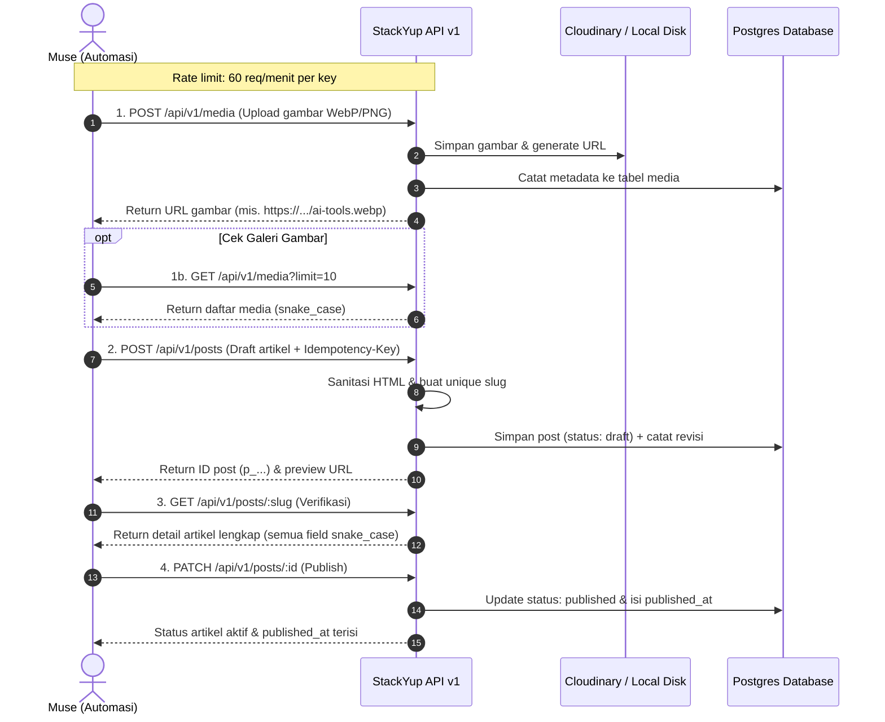

# StackYup CMS — Panduan Publishing API untuk Muse 🚀

Panduan ini berisi kontrak endpoint resmi, standar autentikasi, spesifikasi snake_case, format error lengkap, dan contoh cURL siap pakai untuk alur kerja penerbitan artikel harian Muse.

> [!TIP]
> **Untuk Autonomous Agents & LLM Function Calling:**  
> Gunakan file spesifikasi lengkap dan langsung pakai [AI_AGENT_INTEGRATION.md](file:///d:/PROJECT/GAWEAN/PROJECT/APP/blog-aing/AI_AGENT_INTEGRATION.md) yang berisi prompt persona, OpenAPI 3.1 & MCP Tool schemas, skrip Python runnable, konfigurasi Claude Desktop MCP, dan alur kerja OpenClaw.

---

## 1. Kredensial & Autentikasi

- **Base URL:** `http://localhost:3000/api/v1` (Lokal) atau `https://stackyup.com/api/v1` (Production)
- **Header Autentikasi:** `Authorization: Bearer <API_KEY>`
- **API Key Default:** Tersimpan di file `.env.local` pada variabel `CMS_API_KEY`.
- **Rate Limit:** **60 request/menit** per API key. Jika batas terlampaui, API mengembalikan HTTP `429 RATE_LIMITED` lengkap dengan header `Retry-After`.

> ⚠️ **PENTING KEAMANAN:**  
> **Jangan pernah commit file `.env.local` ke git repository!**  
> File ini menyimpan kredensial rahasia seperti `CMS_API_KEY`, `DATABASE_URL`, dan API secret Cloudinary. Pastikan `.env.local` selalu terdaftar di file `.gitignore`.

---

## 2. Alur Kerja Harian Muse (End-to-End)



---

## 3. Contoh Perintah cURL

Set variabel environment terlebih dahulu di terminal:
```bash
export CMS_API_KEY="isi_api_key_anda"
export CMS_URL="http://localhost:3000/api/v1"
```

### Langkah 1: Upload Ilustrasi / Hero Image (POST `/api/v1/media`)
> [!NOTE]
> Karena blog StackYup menargetkan audiens US/UK (English), **alt text wajib dalam Bahasa Inggris** agar optimal untuk SEO dan keterbacaan mesin pencari.

```bash
curl -X POST "$CMS_URL/media" \
  -H "Authorization: Bearer $CMS_API_KEY" \
  -F "file=@illustration.webp" \
  -F "alt=Comparison infographic showing the 7 best AI tools for freelancers in 2026"
```

**Contoh Response (201 Created):**
```json
{
  "id": "m_01j9xyz123...",
  "url": "http://localhost:3000/uploads/m_01j9xyz123.webp",
  "alt": "Comparison infographic showing the 7 best AI tools for freelancers in 2026",
  "width": 1600,
  "height": 900
}
```

---

### Langkah 1b: Cek Galeri / List Media (GET `/api/v1/media`)
Gunakan endpoint ini untuk mengecek daftar gambar yang sudah pernah diupload.

```bash
curl -X GET "$CMS_URL/media?limit=20&offset=0" \
  -H "Authorization: Bearer $CMS_API_KEY"
```

**Contoh Response (200 OK):**
```json
{
  "items": [
    {
      "id": "m_01j9xyz123...",
      "filename": "m_01j9xyz123.webp",
      "url": "http://localhost:3000/uploads/m_01j9xyz123.webp",
      "alt": "Comparison infographic showing the 7 best AI tools for freelancers in 2026",
      "width": 1600,
      "height": 900,
      "size_bytes": 142850,
      "mime_type": "image/webp",
      "created_at": "2026-10-01T07:50:00.000Z"
    }
  ],
  "pagination": {
    "limit": 20,
    "offset": 0,
    "total": 1
  }
}
```

---

### Langkah 2: Buat Draft Artikel (POST `/api/v1/posts`)
Kirimkan header `Idempotency-Key` untuk mencegah duplikasi artikel jika terjadi network timeout. Semua field menggunakan format `snake_case`.

```bash
curl -X POST "$CMS_URL/posts" \
  -H "Authorization: Bearer $CMS_API_KEY" \
  -H "Content-Type: application/json" \
  -H "Idempotency-Key: $(uuidgen 2>/dev/null || echo post-$(date +%s))" \
  -d '{
    "title": "7 Best AI Tools for Freelancers in 2026",
    "content_html": "<p>Freelancing in 2026 requires speed and smart automation.</p><h2>1. Claude 3.7 Sonnet & ChatGPT Pro</h2><p>For writing, research, and client proposals...</p>",
    "excerpt": "Discover the 7 top-rated AI tools that will save you 15+ hours weekly in 2026.",
    "meta_description": "Boost your freelance career with the 7 best AI tools in 2026 for writing, design, and client acquisition.",
    "featured_image_url": "http://localhost:3000/uploads/m_01j9xyz123.webp",
    "featured_image_alt": "Comparison infographic showing the 7 best AI tools for freelancers in 2026",
    "tags": ["AI Tools", "Freelancers", "SaaS Review"],
    "faq": [
      {
        "question": "What is the best free AI tool for freelancers?",
        "answer": "Tools offering generous free tiers include ChatGPT, Claude, and Canva AI."
      }
    ],
    "status": "draft"
  }'
```

**Contoh Response (201 Created):**
```json
{
  "id": "p_r7q9k2x1...",
  "slug": "7-best-ai-tools-for-freelancers-in-2026",
  "url": "http://localhost:3000/7-best-ai-tools-for-freelancers-in-2026",
  "status": "draft"
}
```

---

### Langkah 3: Verifikasi Artikel (GET `/api/v1/posts/:slug_atau_id`)
Periksa konten draft sebelum diterbitkan. Seluruh field dikembalikan dalam **snake_case**:

```bash
curl -X GET "$CMS_URL/posts/7-best-ai-tools-for-freelancers-in-2026" \
  -H "Authorization: Bearer $CMS_API_KEY"
```

**Contoh Response (200 OK):**
```json
{
  "id": "p_r7q9k2x1...",
  "title": "7 Best AI Tools for Freelancers in 2026",
  "slug": "7-best-ai-tools-for-freelancers-in-2026",
  "content_html": "<p>Freelancing in 2026 requires speed...</p>",
  "excerpt": "Discover the 7 top-rated AI tools...",
  "meta_description": "Boost your freelance career with...",
  "featured_image_url": "http://localhost:3000/uploads/m_01j9xyz123.webp",
  "featured_image_alt": "Comparison infographic showing the 7 best AI tools for freelancers in 2026",
  "tags": ["AI Tools", "Freelancers", "SaaS Review"],
  "faq": [
    {
      "question": "What is the best free AI tool for freelancers?",
      "answer": "Tools offering generous free tiers include ChatGPT, Claude, and Canva AI."
    }
  ],
  "status": "draft",
  "published_at": null,
  "created_at": "2026-10-01T07:52:00.000Z",
  "updated_at": "2026-10-01T07:52:00.000Z",
  "claps": 0,
  "author_name": "Adit",
  "url": "http://localhost:3000/7-best-ai-tools-for-freelancers-in-2026"
}
```

---

### Langkah 4: Terbitkan Artikel (Publish via PATCH `/api/v1/posts/:id`)
Setelah verifikasi selesai, terbitkan artikel dengan mengirimkan `status: "published"`. Response wajib menggunakan key `published_at` (bukan camelCase `publishedAt`).

```bash
curl -X PATCH "$CMS_URL/posts/p_r7q9k2x1..." \
  -H "Authorization: Bearer $CMS_API_KEY" \
  -H "Content-Type: application/json" \
  -d '{
    "status": "published"
  }'
```

**Contoh Response (200 OK):**
```json
{
  "id": "p_r7q9k2x1...",
  "title": "7 Best AI Tools for Freelancers in 2026",
  "slug": "7-best-ai-tools-for-freelancers-in-2026",
  "status": "published",
  "published_at": "2026-10-01T07:55:00.000Z",
  "created_at": "2026-10-01T07:52:00.000Z",
  "updated_at": "2026-10-01T07:55:00.000Z",
  "url": "http://localhost:3000/7-best-ai-tools-for-freelancers-in-2026"
}
```

---

### Langkah 5 (Opsional): Buat Halaman Statis (POST `/api/v1/pages`)
```bash
curl -X POST "$CMS_URL/pages" \
  -H "Authorization: Bearer $CMS_API_KEY" \
  -H "Content-Type: application/json" \
  -d '{
    "title": "About StackYup",
    "content_html": "<p>StackYup provides honest, in-depth reviews and benchmarks for modern AI tools and SaaS.</p>",
    "meta_description": "Learn more about StackYup mission and review methodology.",
    "status": "published"
  }'
```

---

## 4. Format Error Standar

Semua error mengembalikan struktur JSON konsisten dengan status HTTP yang akurat:

```json
{
  "error": {
    "code": "VALIDATION_ERROR",
    "message": "Field 'published_at' is required when status is 'scheduled'",
    "details": {
      "status": "scheduled"
    }
  }
}
```

### Tabel Status Error Resmi

| HTTP Status | Error Code | Keterangan |
|:---|:---|:---|
| `401` | `UNAUTHORIZED` | Header `Authorization` tidak ada, format salah, atau API Key tidak valid. |
| `403` | `FORBIDDEN` | API Key sudah dinonaktifkan / dicabut (`isActive = false`), atau tidak memiliki izin akses ke resource. |
| `404` | `NOT_FOUND` | Post, media, atau halaman tidak ditemukan di database. |
| `422` | `VALIDATION_ERROR` | Format payload JSON tidak sesuai schema (mis. `content_html` kosong atau field wajib `published_at` absen saat status `scheduled`). |
| `429` | `RATE_LIMITED` | Kuota request terlampaui (**maksimal 60 request/menit per API Key**). Server menyertakan header `Retry-After: <detik>`. |
| `500` | `INTERNAL_SERVER_ERROR` | Kesalahan internal server atau kegagalan koneksi database. |
