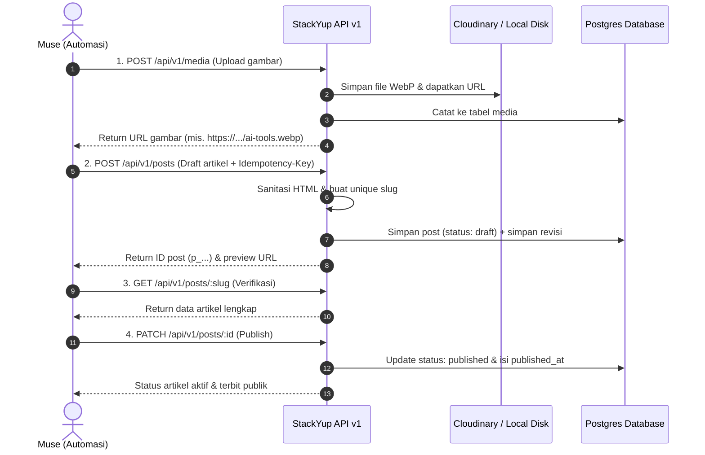

# StackYup CMS — Panduan Publishing API untuk Muse 🚀

Panduan ini berisi kontrak endpoint, autentikasi, dan contoh perintah cURL siap pakai untuk alur kerja penerbitan artikel harian Muse tanpa perlu membuka browser.

---

## 1. Kredensial & Autentikasi

- **Base URL:** `http://localhost:3000/api/v1` (Lokal) atau `https://<domain-anda>/api/v1` (Production)
- **Header Autentikasi:** `Authorization: Bearer <API_KEY>`
- **API Key Default:** Tersimpan di file `.env.local` pada variabel `CMS_API_KEY`.

---

## 2. Alur Kerja Harian Muse (End-to-End)



---

## 3. Contoh Lengkap cURL

Set variabel environment terlebih dahulu di terminal:
```bash
export CMS_API_KEY="isi_api_key_anda"
export CMS_URL="http://localhost:3000/api/v1"
```

### Langkah 1: Upload Ilustrasi / Gambar
```bash
curl -X POST "$CMS_URL/media" \
  -H "Authorization: Bearer $CMS_API_KEY" \
  -F "file=@ilustrasi.png" \
  -F "alt=Infografis 7 AI Tools Terbaik untuk Freelancer 2026"
```
**Contoh Response (201 Created):**
```json
{
  "id": "m_01j9xyz123...",
  "url": "http://localhost:3000/uploads/m_01j9xyz123.png",
  "alt": "Infografis 7 AI Tools Terbaik untuk Freelancer 2026",
  "width": 1600,
  "height": 900
}
```

---

### Langkah 2: Buat Draft Artikel
```bash
curl -X POST "$CMS_URL/posts" \
  -H "Authorization: Bearer $CMS_API_KEY" \
  -H "Content-Type: application/json" \
  -H "Idempotency-Key: $(uuidgen 2>/dev/null || echo post-$(date +%s))" \
  -d '{
    "title": "7 Best AI Tools for Freelancers in 2026",
    "content_html": "<p>Freelancing in 2026 requires speed and smart automation.</p><h2>1. Claude 3.7 Sonnet & ChatGPT Pro</h2><p>For writing, research, and ideation...</p>",
    "excerpt": "Discover the 7 top-rated AI tools that will save you 15+ hours weekly in 2026.",
    "meta_description": "Boost your freelance career with the 7 best AI tools in 2026 for writing, design, and client acquisition.",
    "featured_image_url": "http://localhost:3000/uploads/m_01j9xyz123.png",
    "featured_image_alt": "Infografis 7 AI Tools Terbaik untuk Freelancer 2026",
    "tags": ["AI Tools", "Freelancers", "SaaS Review"],
    "faq": [
      {
        "question": "What is the best free AI tool for freelancers?",
        "answer": "Tools offering generous free tiers include ChatGPT, Claude, and Canva AI."
      }
    ],
    "status": "draft"
  }'
```
**Contoh Response (201 Created):**
```json
{
  "id": "p_r7q9k2x1...",
  "slug": "7-best-ai-tools-for-freelancers-in-2026",
  "url": "http://localhost:3000/7-best-ai-tools-for-freelancers-in-2026",
  "status": "draft"
}
```

---

### Langkah 3: Verifikasi Artikel (Ambil Detail by Slug)
```bash
curl -X GET "$CMS_URL/posts/7-best-ai-tools-for-freelancers-in-2026" \
  -H "Authorization: Bearer $CMS_API_KEY"
```

---

### Langkah 4: Terbitkan Artikel (Publish via PATCH)
```bash
curl -X PATCH "$CMS_URL/posts/p_r7q9k2x1..." \
  -H "Authorization: Bearer $CMS_API_KEY" \
  -H "Content-Type: application/json" \
  -d '{
    "status": "published"
  }'
```
**Contoh Response (200 OK):**
```json
{
  "id": "p_r7q9k2x1...",
  "slug": "7-best-ai-tools-for-freelancers-in-2026",
  "status": "published",
  "publishedAt": "2026-10-01T07:55:00.000Z",
  "url": "http://localhost:3000/7-best-ai-tools-for-freelancers-in-2026"
}
```

---

### Langkah 5 (Opsional): Buat Halaman Statis (Pages)
```bash
curl -X POST "$CMS_URL/pages" \
  -H "Authorization: Bearer $CMS_API_KEY" \
  -H "Content-Type: application/json" \
  -d '{
    "title": "About StackYup",
    "content_html": "<p>StackYup provides honest, in-depth reviews and benchmarks for modern AI tools and SaaS.</p>",
    "meta_description": "Learn more about StackYup mission and review methodology.",
    "status": "published"
  }'
```

---

## 4. Format Error Standar

Semua error mengembalikan struktur JSON konsisten:
```json
{
  "error": {
    "code": "VALIDATION_ERROR",
    "message": "Field 'published_at' is required when status is 'scheduled'",
    "details": {
      "status": "scheduled"
    }
  }
}
```

| HTTP Status | Error Code | Keterangan |
|---|---|---|
| `401` | `UNAUTHORIZED` | Header Authorization kosong atau API Key salah/dicabut |
| `404` | `NOT_FOUND` | Post, media, atau halaman tidak ditemukan |
| `422` | `VALIDATION_ERROR` | Format body JSON tidak sesuai schema atau field wajib kosong |
| `500` | `INTERNAL_SERVER_ERROR` | Kesalahan internal server / koneksi database |
