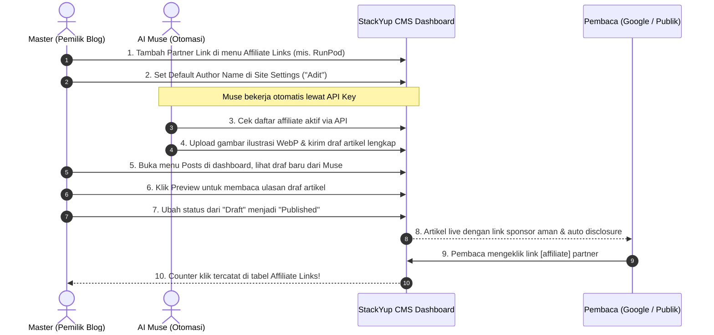

# StackYup CMS — Panduan Pengguna & Manual Operasional Admin 📘

> **Dokumen:** Panduan Pengguna Resmi (User Manual)  
> **Versi Aplikasi:** StackYup CMS v2.1  
> **Target Pengguna:** Pemilik Situs ("Master"), Administrator, Editor Konten, Manajer Afiliasi  
> **Bahasa:** Bahasa Indonesia (dengan istilah teknis yang mudah dipahami)

---

## Daftar Isi
1. [Mengenal StackYup CMS](#1-mengenal-stackyup-cms)
2. [Cara Masuk & Navigasi Dashboard](#2-cara-masuk--navigasi-dashboard)
3. [Fitur 1: Kelola Artikel (Posts) — Menulis & Menerbitkan](#3-fitur-1-kelola-artikel-posts--menulis--menerbitkan)
4. [Fitur 2: Affiliate Links — Monetisasi Kemitraan Komersial](#4-fitur-2-affiliate-links--monetisasi-kemitraan-komersial)
5. [Fitur 3: Halaman Statis (Pages)](#5-fitur-3-halaman-statis-pages)
6. [Fitur 4: Kategori & Tags](#6-fitur-4-kategori--tags)
7. [Fitur 5: Media Library (Galeri Gambar)](#7-fitur-5-media-library-galeri-gambar)
8. [Fitur 6: Penempatan Iklan (Advertisements & AdSense)](#8-fitur-6-penempatan-iklan-advertisements--adsense)
9. [Fitur 7: Moderasi Komentar (Comments)](#9-fitur-7-moderasi-komentar-comments)
10. [Fitur 8: Subscribers & Newsletter](#10-fitur-8-subscribers--newsletter)
11. [Fitur 9: Pengalihan URL (Redirects 301 / 302)](#11-fitur-9-pengalihan-url-redirects-301--302)
12. [Fitur 10: Navigasi Menu Header & Footer (Menus)](#12-fitur-10-navigasi-menu-header--footer-menus)
13. [Fitur 11: Desain Tampilan & Tema (Theme)](#13-fitur-11-desain-tampilan--tema-theme)
14. [Fitur 12: Analytics & Statistik Kinerja](#14-fitur-12-analytics--statistik-kinerja)
15. [Fitur 13: Kunci API & Otomasi AI (API Keys & AI Agents)](#15-fitur-13-kunci-api--otomasi-ai-api-keys--ai-agents)
16. [Fitur 14: Audit Kesehatan SEO & Sitemap](#16-fitur-14-audit-kesehatan-seo--sitemap)
17. [Fitur 15: Pengaturan Situs & Nama Pena Default (Site Settings)](#17-fitur-15-pengaturan-situs--nama-pena-default-site-settings)
18. [Fitur 16: Manajemen Akun Admin (Users)](#18-fitur-16-manajemen-akun-admin-users)
19. [Fitur 17: Backup & Import Data](#19-fitur-17-backup--import-data)
20. [Fitur 18: Status Kesehatan Sistem (System Health)](#20-fitur-18-status-kesehatan-sistem-system-health)
21. [Alur Kerja Praktis: Kolaborasi Master & AI Muse](#21-alur-kerja-praktis-kolaborasi-master--ai-muse)

---

## 1. Mengenal StackYup CMS

Selamat datang di **StackYup CMS**! Aplikasi ini dirancang khusus untuk mengelola blog publikasi teknologi, review software, dan perbandingan kecerdasan buatan (*AI tools*) dengan target pembaca internasional (Amerika Serikat, Inggris, dan global).

### Keunggulan Utama StackYup CMS:
- **Nol Biaya Hosting Bulanan**: Berjalan di atas infrastruktur serverless Vercel dan database PostgreSQL gratis (Neon), sehingga Anda tidak perlu membayar tagihan VPS atau cPanel.
- **Kecepatan Tinggi & SEO-First**: Dibuat agar halaman terbuka secepat kilat dengan skor Core Web Vitals hijau sempurna, dilengkapi generator skema Google otomatis (*Article*, *FAQ*, dan *Breadcrumb*).
- **Otomasi AI Publishing (Muse & Agent Lainnya)**: Sistem memiliki pintu integrasi otomatis (*Publishing API & MCP*) sehingga asisten AI Anda (seperti Muse) dapat mengunggah draf artikel lengkap dengan gambar langsung ke blog tanpa Anda harus membuka browser.
- **Monetisasi Cerdas (Afiliasi & AdSense)**: Pengelolaan link partner komersial terpusat dengan sistem shortcode cerdas, pelacakan klik, dan penayangan kotak keterbukaan komisi (*FTC Affiliate Disclosure*) yang diatur secara otomatis oleh sistem.

---

## 2. Cara Masuk & Navigasi Dashboard

### Cara Login ke Panel Admin
1. Buka browser Anda dan akses alamat:  
   `https://domain-anda.com/admin/login` (atau `http://localhost:3000/admin/login` saat di komputer lokal).
2. Masukkan alamat **Email Admin** dan **Password** Anda.
3. Klik tombol **Sign In to Admin Console**.
4. Sistem akan memvalidasi kredensial Anda dan langsung mengarahkan Anda ke Halaman Beranda Dashboard (`/admin`).

### Mengenal Menu Sidebar
Di sebelah kiri layar terdapat menu navigasi yang dikelompokkan rapi:
- **Overview**: Dashboard utama memuat rangkuman statistik penting.
- **Content**: Kelola artikel (*Posts*), halaman statis (*Pages*), kategori, tags, galeri gambar (*Media*), dan moderasi komentar.
- **Monetization**: Pengaturan link partner komersial (*Affiliate Links*) dan penempatan iklan banner/AdSense (*Advertisements*).
- **Growth & Audience**: Statistik pengunjung (*Analytics*), pelanggan email (*Subscribers*), dan siaran email (*Newsletter*).
- **Automation**: Manajemen kunci akses bot AI (*API Keys*) dan panduan integrasi agen AI (*AI Agents*).
- **Configuration & Tools**: Audit SEO (*SEO*), generator sitemap (*Sitemap*), pengalihan link (*Redirects*), menu navigasi (*Menus*), cadangan data (*Backups*), import artikel (*Import*), identitas situs (*Settings*), profil admin (*Users*), dan status server (*System*).

---

## 3. Fitur 1: Kelola Artikel (Posts) — Menulis & Menerbitkan

Halaman ini adalah pusat aktivitas utama blog Anda. Di sini Anda dapat melihat semua artikel yang pernah ditulis, menyaring berdasarkan status, mencari judul tertentu, dan membuat artikel baru.

### 3 Status Artikel di StackYup:
1. **Draft**: Draf artikel yang sedang ditulis atau dikirim oleh AI Muse. Draf ini **belum bisa dibaca oleh umum** dan tidak akan terindeks Google.
2. **Scheduled (Terjadwal)**: Artikel yang sudah selesai tetapi diatur untuk terbit otomatis pada tanggal dan jam tertentu di masa depan.
3. **Published**: Artikel yang sudah aktif tayang di blog publik dan siap dibaca oleh pengunjung.

### Langkah-Langkah Menulis Artikel Baru:
Klik tombol hijau **"+ New Article"** di pojok kanan atas untuk membuka Editor Artikel canggih:

1. **Judul Artikel (Title)**:  
   Tulis judul yang menarik dan jelas. Disarankan antara 40 hingga 70 karakter (misal: *7 Best Serverless GPU Providers for AI Inference in 2026*).
2. **Slug URL**:  
   Slug adalah bagian alamat web artikel (contoh: `best-serverless-gpu-providers-2026`).  
   *Tip:* Saat Anda mengetik judul, slug akan terisi otomatis secara rapi. Anda juga bisa mengeditnya manual jika ingin slug yang lebih ringkas.
3. **Editor Isi Artikel (WYSIWYG)**:  
   Tulis isi artikel dengan format yang rapi:
   - Gunakan **Heading 2 (H2)** untuk judul bab utama.
   - Gunakan **Heading 3 (H3)** untuk sub-bab.
   - Gunakan **Bold**, *Italic*, dan **Bullet List** untuk memudahkan pembaca membaca cepat.
   - Gunakan blok **Code** untuk menyisipkan perintah terminal atau kode pemrograman (sistem mendukung penyorotan sintaks otomatis).
4. **Ringkasan (Excerpt)**:  
   Tulis rangkuman 1–2 kalimat (maksimal 300 karakter). Ringkasan ini akan tampil pada kartu artikel di halaman depan dan cuplikan RSS.
5. **Deskripsi Penelusuran (Meta Description)**:  
   Tulis deskripsi singkat untuk hasil pencarian Google.  
   *Perhatikan indikator warna:* Panjang ideal adalah **130 hingga 160 karakter**. Jika terlalu pendek atau terlalu panjang, indikator akan mengingatkan Anda agar hasil di Google SERP tidak terpotong.
6. **Gambar Utama (Featured Image)**:  
   - Klik untuk mengunggah gambar sampul artikel berformat WebP atau PNG/JPG berkualitas tinggi.
   - **Wajib Mengisi Alt Text dalam Bahasa Inggris**: Karena blog menargetkan pembaca luar negeri, deskripsikan isi gambar dalam Bahasa Inggris (misal: *Comparison infographic of serverless GPU speeds*). Alt text ini sangat penting untuk peringkat Google Images dan aksesibilitas pembaca tunanetra.
7. **Kategori & Tags**:  
   Pilih kategori utama (misal: *AI Tools*) dan tambahkan beberapa tag kata kunci (misal: *GPU, Deep Learning, Cloud*).
8. **FAQ Builder (Tanya Jawab Pintar)**:  
   Tambahkan 2–4 pertanyaan dan jawaban umum seputar topik artikel.  
   *Manfaat luar biasa:* Google akan membaca data ini dan sering kali menampilkan artikel Anda dengan tampilan akordeon FAQ interaktif di hasil pencarian, yang melipatgandakan jumlah klik pengunjung!
9. **Nama Penulis (Author Persona)**:  
   - **Biarkan Kosong (Rekomendasi)**: Jika dikosongkan, artikel akan otomatis menampilkan **Default Author Name** yang sudah Anda atur di Pengaturan Situs (misal: "Adit").
   - **Isi Manual**: Hanya jika artikel ini ditulis oleh penulis tamu atau nama pena khusus (misal: "Dr. Sarah Connor").
10. **Memilih Status & Menyimpan**:  
    - Pilih **Draft** jika masih ingin diedit nanti.
    - Pilih **Published** jika ingin langsung tayang seketika.
    - Pilih **Scheduled** dan tentukan tanggal serta jam tayangnya.
    - Klik tombol **Save Article**.

### Menonton Live Preview & Memulihkan Versi Lama (Revisions):
- **Live Preview**: Klik tombol *Preview* untuk melihat tampilan persis bagaimana artikel akan dilihat oleh pembaca di perangkat desktop maupun smartphone sebelum dipublikasikan.
- **Riwayat Revisi (Revisions)**: Setiap kali Anda atau AI menyimpan perubahan, sistem mencatat salinan cadangan. Jika Anda tidak sengaja menghapus paragraf penting, Anda dapat membuka tab *Revisions* dan mengembalikan (*restore*) artikel ke versi sebelumnya dengan 1 klik.

---

## 4. Fitur 2: Affiliate Links — Monetisasi Kemitraan Komersial

> [!IMPORTANT]
> **Halaman Affiliate Links Itu Buat Apa?**  
> Halaman ini adalah **pusat pengendali seluruh link komisi bisnis Anda**. Blog StackYup mengulas berbagai software SaaS, AI tools, dan layanan cloud yang memiliki program komisi referral. Melalui halaman ini, Anda mendaftarkan produk rekanan dan link afiliasi khusus Anda secara terpusat.

### Mengapa Link Afiliasi Tidak Boleh Ditulis Mentah di Artikel?
Jika Anda memasukkan link referral mentah (misal: `https://runpod.io?ref=adit123`) langsung ke dalam teks artikel:
1. Jika suatu hari link referral Anda berganti, Anda harus membongkar dan mengedit puluhan artikel satu per satu.
2. Link mentah berisiko terkena penalti penurunan peringkat oleh Google jika lupa diberi label relasi sponsor.
3. Anda tidak bisa melacak artikel mana atau produk apa yang paling sering diklik pengunjung.

**Solusi StackYup:** Cukup daftarkan partner di halaman **Affiliate Links**, lalu Anda hanya perlu memanggilnya dengan kode singkat (**Shortcode**) di dalam artikel!

---

### Cara Menambah Partner Afiliasi Baru (Langkah demi Langkah):

1. Masuk ke menu **Affiliate Links** di sidebar kiri.
2. Klik tombol hijau **"+ Add Partner Link"** di pojok kanan atas.
3. Sebuah jendela formulir akan terbuka. Isi kolom-kolom berikut:
   - **Partner / Brand Name**: Nama resmi produk (contoh: `RunPod GPU Cloud`).
   - **Category**: Jenis produk (contoh: `AI Cloud`, `Developer Tool`, atau `Productivity`).
   - **Destination URL**: Alamat website resmi produk tanpa kode referral (contoh: `https://runpod.io`).
   - **Affiliate / Referral URL**: Link referral unik milik Anda yang berisi kode pelacak komisi (contoh: `https://runpod.io?ref=stackyup`).
   - **Disclosure Type**: Keterangan relasi kemitraan (contoh: `Sponsored partner link` atau `Affiliate commission link`).
   - **Status**: Pilih **Active** agar dapat digunakan, atau **Paused** jika program afiliasi sedang ditutup sementara.
4. Klik **Save Partner**.
5. Selesai! Partner baru Anda kini memiliki kode identitas (ID), misalnya `runpod` atau `aff_claude`.

---

### Cara Memakai Link Partner di Dalam Artikel:

Saat Anda atau AI Muse sedang menulis artikel, Anda tidak perlu menempelkan link URL yang panjang. Cukup ketik kode shortcode berikut di badan tulisan:

#### Contoh 1: Menggunakan Nama Brand Bawaan
```text
Untuk kebutuhan fine-tuning model LLM skala besar, saya menyarankan menggunakan [affiliate id="runpod"].
```
*Tampilan di mata pembaca:*  
Kata **RunPod** otomatis berubah menjadi link klik yang mengarah ke link afiliasi Anda.

#### Contoh 2: Menggunakan Kalimat Ajakan Bebas (Custom Text)
```text
Anda dapat mulai menyewa cluster GPU murah melalui [affiliate id="runpod" text="Daftar Akun RunPod Sekarang"].
```
*Tampilan di mata pembaca:*  
Kalimat **"Daftar Akun RunPod Sekarang"** akan menjadi link yang dapat diklik pembaca.

---

### Keajaiban Otomatis di Balik Layar:

1. **Aman dari Penalti Google**: Sistem secara otomatis menambahkan atribut `rel="sponsored nofollow"` pada link tersebut. Ini adalah kepatuhan resmi yang disyaratkan Google Search Central agar blog Anda tidak dianggap melakukan manipulasi backlink.
2. **Kotak Keterbukaan Komisi Otomatis (FTC Disclosure)**:  
   Begitu sistem mendeteksi ada shortcode `[affiliate]` di dalam artikel, sistem akan **otomatis menampilkan kotak resmi pemberitahuan pembaca di bagian atas artikel** (tepat di atas badan artikel dan sebelum isi tulisan dimulai):
   > *"Affiliate Disclosure: StackYup is reader-supported. When you purchase through links on our site, we may earn an affiliate commission at no extra cost to you."*  
   *Mengapa di atas?* Sesuai panduan resmi FTC (*Federal Trade Commission*) AS dan regulasi Google AdSense, pernyataan keterbukaan sponsor harus bersifat *clear and conspicuous* (jelas dan mencolok) di awal sebelum pembaca mengeklik tautan atau membaca rekomendasi produk, bukan tersembunyi di paling bawah artikel.  
   **Anda dan AI Muse dilarang dan tidak perlu mengetik pernyataan ini secara manual!**
3. **Penghitung Klik Otomatis (Clicks Tracker)**:  
   Setiap kali ada pengunjung yang mengeklik link partner tersebut, sistem akan mencatatnya. Anda dapat melihat total klik langsung di tabel halaman *Affiliate Links* untuk mengetahui produk mana yang menghasilkan minat tertinggi.

---

## 5. Fitur 3: Halaman Statis (Pages)

### Apa Perbedaan Halaman Statis (*Pages*) dengan Artikel (*Posts*)?
- **Posts (Artikel)**: Konten yang memiliki tanggal terbit, memiliki kategori, masuk ke arsip blog, dan terdaftar di RSS feed (misal: berita, ulasan tool).
- **Pages (Halaman Statis)**: Konten permanen yang jarang berubah dan berdiri sendiri di alamat `/page/{slug}`.

### 4 Halaman Statis Wajib untuk Lolos Syarat Google AdSense:
1. **About Us (`/page/about`)**: Menjelaskan siapa pengelola blog StackYup, keahlian tim di bidang software engineering, dan tujuan blog.
2. **Contact (`/page/contact`)**: Memberikan alamat email resmi agar pembaca atau calon pengiklan dapat menghubungi Anda.
3. **Privacy Policy (`/page/privacy`)**: Kebijakan privasi mengenai penggunaan cookie, data pengunjung, dan kepatuhan GDPR/CCPA.
4. **Disclaimer (`/page/disclaimer`)**: Pernyataan resmi mengenai ulasan independen dan keterlibatan komisi afiliasi.

Di halaman **Pages**, Anda dapat menambah halaman baru atau memperbarui isi halaman kapan saja menggunakan editor teks yang sama dengan editor artikel.

---

## 6. Fitur 4: Kategori & Tags

Pengelompokan konten yang rapi sangat disukai oleh Google dan pembaca:
- **Kategori (Categories)**: Topik payung utama blog Anda. Disarankan membuat 4–6 kategori utama saja (contoh: *AI Tools*, *Developer Workflows*, *Productivity Apps*, *Cloud Infrastructure*).
- **Tags**: Label kata kunci yang lebih spesifik untuk menghubungkan artikel-artikel terkait lintas kategori (contoh: *Python*, *Llama-3*, *Next.js*, *Free Tier*).

Di kedua menu ini, Anda dapat menambah kategori/tag baru, menentukan deskripsi singkat, dan melihat berapa jumlah artikel yang tergabung di dalamnya.

---

## 7. Fitur 5: Media Library (Galeri Gambar)

Halaman **Media** berfungsi sebagai tempat penyimpanan seluruh aset visual blog Anda.

### Cara Mengunggah Gambar:
1. Buka menu **Media**.
2. Tarik (*drag and drop*) gambar dari komputer Anda ke kotak unggah, atau klik tombol **Upload Image**.
3. Sistem secara otomatis akan mengonversi dan mengompresi gambar menjadi format modern **WebP** yang berukuran ringan tanpa menurunkan ketajaman visual.
4. Masukkan **Alt Text** gambar dalam Bahasa Inggris.

### Menggunakan Gambar di Dalam Tubuh Artikel:
Setiap gambar yang diunggah memiliki ID unik (contoh: `m_01j9a4b8`). Anda dapat menyalin ID tersebut dan memasukkannya di tengah paragraf artikel menggunakan shortcode:
```text
[img id="m_01j9a4b8" alt="Diagram perbandingan latensi GPU" caption="Hasil pengujian latensi pada 50.000 request"]
```
Sistem akan otomatis merender gambar tersebut secara responsif di tengah tulisan lengkap dengan keterangan gambar (*caption*).

---

## 8. Fitur 6: Penempatan Iklan (Advertisements & AdSense)

Halaman ini memungkinkan Anda memonetisasi blog melalui iklan banner atau Google AdSense tanpa harus mengubah kode pemrograman situs.

### 4 Slot Iklan Strategis yang Tersedia:
1. **Article Right Sidebar (Sticky)**: Iklan di kolom kanan artikel yang akan tetap terlihat mengikuti scroll pembaca di layar komputer.
2. **In-Article Content (After 3rd Paragraph)**: Iklan yang otomatis disisipkan di tengah artikel tepat setelah paragraf ketiga (lokasi dengan keterlihatan tertinggi).
3. **Bottom Article**: Iklan yang muncul di akhir artikel tepat sebelum daftar rekomendasi bacaan lain.
4. **Homepage Sidebar Banner**: Iklan promosi di halaman beranda blog.

### Cara Mengaktifkan Google AdSense:
1. Pilih slot yang diinginkan (misal: *In-Article Content*).
2. Geser tombol status menjadi **Enabled** (Aktif).
3. Pada pilihan Provider, pilih **Google AdSense**.
4. Masukkan **Ad Client ID** Anda (contoh: `ca-pub-1234567890123456`).
5. Masukkan **Ad Slot ID** (contoh: `9876543210`).
6. Klik **Save Placement**.

### Memasang Banner Sponsor Sendiri:
Jika ada perusahaan software yang ingin memasang iklan banner mandiri di blog Anda, pilih opsi **Custom Banner / HTML**, lalu tempelkan kode HTML banner atau gambar promosi mereka.

---

## 9. Fitur 7: Moderasi Komentar (Comments)

Setiap artikel memiliki kolom komentar di bagian bawah agar pembaca dapat berdiskusi atau bertanya. Halaman **Comments** di panel admin berfungsi untuk menyaring komentar yang masuk.

### Status Komentar:
- **Pending**: Komentar baru yang menunggu tinjauan Anda sebelum tampil ke publik.
- **Approved**: Komentar yang sudah disetujui dan dapat dibaca oleh seluruh pengunjung blog.
- **Spam**: Komentar robot atau promosi judi/obat terlarang. Menandai spam akan menyembunyikan komentar tersebut.
- **Trash**: Komentar yang telah dihapus.

*Tips:* Periksa halaman komentar secara berkala untuk menyetujui komentar yang membangun dan membuang komentar spam agar reputasi blog tetap terjaga.

---

## 10. Fitur 8: Subscribers & Newsletter

### Membangun Daftar Pembaca Setia (Audience List):
Di bagian bawah blog terdapat formulir berlangganan email (*Newsletter Subscribe*). Ketika pengunjung memasukkan alamat email mereka:
1. Alamat email tersebut otomatis tercatat di halaman **Subscribers**.
2. Anda dapat melihat tanggal bergabung dan status keaktifan mereka.
3. Anda dapat mengeklik tombol **Export CSV** untuk mengunduh seluruh daftar email tersebut ke format Excel/CSV untuk diimpor ke layanan email marketing seperti Mailchimp, Substack, atau Beehiiv.

### Mengirim Newsletter Langsung dari Dashboard:
Di menu **Newsletter**, Anda dapat menulis draf pesan singkat untuk menyapa pelanggan setia Anda saat ada artikel baru yang penting dan mengirimkannya secara langsung.

---

## 11. Fitur 9: Pengalihan URL (Redirects 301 / 302)

### Kapan Fitur Ini Sangat Dibutuhkan?
1. **Migrasi dari Blogger / WordPress Lama**:  
   Jika blog Anda sebelumnya berada di Blogger dengan pola link seperti `/2024/05/best-ai-tools.html`, Anda dapat mengarahkannya ke link StackYup yang baru (`/best-ai-tools`).
2. **Mengubah Judul / Slug Artikel**:  
   Jika artikel lama sudah terlanjur beredar di Google tetapi Anda ingin mengganti slug URL-nya, pasang aturan redirect agar pengunjung yang mengeklik link lama tidak mendapati pesan error 404 (Halaman Tidak Ditemukan).

### Cara Menambah Aturan Redirect:
1. Masukkan **From Path** (link lama): contoh `/2024/05/artikel-lama.html`.
2. Masukkan **To Path** (link baru): contoh `/artikel-baru`.
3. Pilih Status **301 (Permanent Redirect)** agar kekuatan ranking SEO di Google dialihkan 100% ke link yang baru.
4. Klik **Add Redirect**.

---

## 12. Fitur 10: Navigasi Menu Header & Footer (Menus)

Halaman ini mengatur link apa saja yang muncul di bilah navigasi atas (Navbar) dan bagian bawah halaman (Footer).

- Anda dapat menambahkan link ke **Kategori Utama** (misal: *AI Tools*, *Reviews*).
- Anda dapat menambahkan link ke **Halaman Statis** (misal: *About*, *Contact*).
- Anda dapat menambahkan link ke **Website Luar** (misal: portofolio GitHub Anda atau akun Twitter/X).
- Anda dapat menggeser urutan menu naik atau turun sesuai selera.

---

## 13. Fitur 11: Desain Tampilan & Tema (Theme)

Halaman **Theme** (berada di bawah kelompok *Appearance* di sidebar) memungkinkan Anda mempersonalisasi estetika visual blog StackYup tanpa perlu menyentuh file kode CSS.

### 1. Memilih Palet Warna Aksen Brand (Brand Accent Color):
Warna ini menentukan aksen tombol utama, badge kategori, garis sorot heading H2, indikator navigasi aktif, dan efek hover di seluruh website:
- **Preset Warna Siap Pakai**:
  - *StackYup Emerald* (`#079653` — Default bawaan yang segar dan profesional)
  - *Electric Indigo* (`#4F46E5` — Modern, bernuansa teknologi tinggi)
  - *Obsidian Cyan* (`#0284C7` — Bersih dan elegan untuk produk SaaS)
  - *Vibrant Crimson* (`#E11D48` — Dinamis dan berani)
  - *Amber Sunset* (`#D97706` — Hangat dan ramah pembaca)
  - *Imperial Violet* (`#7C3AED` — Elegan untuk platform developer)
  - *Deep Forest* (`#059669` — Klasik dan berwibawa)
- **Custom Color Picker**: Anda juga dapat memasukkan kode warna HEX unik sesuai panduan identitas brand Anda sendiri.

### 2. Pilihan Tipografi Editorial (Typography Presets):
StackYup menyediakan 4 keluarga font pilihan yang telah dioptimasi untuk kenyamanan membaca di layar gawai maupun desktop:
- **Plus Jakarta Sans**: Font bawaan modern yang bersih, kontemporer, dan sangat cocok untuk publikasi berita teknologi.
- **Inter**: Standar industri software engineer dunia dengan keterbacaan teknikal tertinggi pada ukuran teks kecil.
- **Outfit**: Karakter geometris modern yang memberikan kesan ramah dan segar.
- **Merriweather**: Font serif klasik berkarakter sastra untuk pengalaman membaca ulasan mendalam (*long-form literary feel*).

### 3. Pratinjau Komponen Langsung (Live Component Preview):
Di samping pengaturan tema, terdapat kotak simulasi interaktif real-time. Anda dapat langsung melihat bagaimana kartu artikel, tombol aksi, badge kategori, dan judul tulisan bertransformasi saat Anda memilih kombinasi warna atau font baru sebelum mengeklik tombol **Save Theme**.

---

## 14. Fitur 12: Analytics & Statistik Kinerja

Halaman **Analytics** memberikan gambaran umum mengenai performa blog Anda:
- **Total Published Posts**: Jumlah artikel aktif yang sudah tayang.
- **Estimated Views**: Estimasi jumlah kunjungan pembaca.
- **Reader Claps**: Jumlah apresiasi tepuk tangan (*claps*) yang diberikan pembaca pada artikel favorit mereka.
- **Top Performing Articles**: Daftar 10 artikel terpopuler yang paling banyak menyedot perhatian pembaca.
- **Integrasi Analitik Pihak Ketiga**: Anda dapat memasukkan **Google Analytics 4 (GA4 Measurement ID)** seperti `G-XXXXXXXXXX` pada menu Pengaturan Situs agar data analitik resmi Google langsung terhubung tanpa perlu mengotak-atik koding website.

---

## 15. Fitur 13: Kunci API & Otomasi AI (API Keys & AI Agents)

> [!TIP]
> **Ini adalah Pintu Rahasia untuk Asisten AI Anda!**  
> AI cerdas seperti **Muse**, Hermes, atau Claude MCP memerlukan izin khusus agar dapat mengirimkan draf artikel langsung ke database blog Anda. Izin tersebut diberikan dalam bentuk **API Key**.

### Cara Membuat Kunci API untuk AI Muse:
1. Buka menu **API Keys**.
2. Klik tombol **"+ Generate New Key"**.
3. Masukkan nama label pengenal, misalnya: `Muse AI Publisher (VPS Server)`.
4. Klik **Generate**.
5. **PENTING: Salin kunci rahasia yang muncul di layar saat itu juga!**  
   Demi alasan keamanan tingkat tinggi, kunci rahasia ini hanya ditampilkan **satu kali**. Simpan kunci tersebut ke dalam file konfigurasi AI Muse Anda (`CMS_API_KEY`).
6. Jika suatu saat laptop atau server Anda dicurigai disusupi pihak lain, Anda cukup mengeklik tombol **Revoke** pada kunci tersebut untuk mencabut hak aksesnya seketika.

### Menu AI Agents:
Menu ini berisi ringkasan status integrasi Model Context Protocol (MCP), panduan konfigurasi Claude Desktop, dan konsol uji coba langsung untuk memastikan agen AI Anda terhubung dengan sempurna.

---

## 16. Fitur 14: Audit Kesehatan SEO & Sitemap

Fitur ini bertindak seperti seorang konsultan SEO pribadi yang mengaudit kualitas artikel Anda:
- **Missing Meta Description**: Menampilkan artikel mana saja yang belum memiliki deskripsi penelusuran Google.
- **Missing Image Alt Text**: Menampilkan artikel mana saja yang gambarnya belum diberi keterangan teks alternatif.
- **Short Content Warning**: Memperingatkan jika ada artikel yang terlalu pendek (di bawah 300 kata) yang berisiko dianggap konten dangkal (*thin content*) oleh Google.
- **Sitemap XML**: Memastikan file peta situs di `https://domain-anda.com/sitemap.xml` selalu terbarukan otomatis setiap kali artikel baru diterbitkan.

---

## 17. Fitur 15: Pengaturan Situs & Nama Pena Default (Site Settings)

Halaman ini mengatur identitas global seluruh blog:

1. **Site Name**: Nama blog Anda (contoh: `StackYup`).
2. **Public URL**: Alamat domain resmi (contoh: `https://stackyup.com`).
3. **Tagline / Deck**: Slogan blog (contoh: *Modern AI & Tech Tools for Freelancers*).
4. **Admin Contact Email**: Alamat email resmi pengelola.
5. **Articles Per Page**: Jumlah artikel yang tampil per halaman di beranda (bawaan: 10 artikel).
6. **Primary Brand Color**: Warna aksen utama blog (bawaan hijau elegan `#079653`). Anda dapat memilih warna lain menggunakan palet visual yang tersedia.
7. **Default Author Name (Nama Pena Default)** ⭐:
   - **Bagaimana cara kerjanya?**  
     Jika kolom ini diisi dengan nama Anda (misalnya: `Adit`), maka **seluruh artikel yang dikirim otomatis oleh AI Muse atau artikel baru yang tidak Anda tentukan penulisnya akan otomatis menampilkan "Adit" sebagai penulisnya di mata pembaca dan Google**.
   - **Kelebihan Luar Biasa**:  
     Jika suatu hari Anda ingin mengubah nama pena blog dari "Adit" menjadi "StackYup Editorial Team", Anda **cukup menggantinya di satu kolom ini saja lalu simpan**. Seluruh ratusan artikel di blog akan otomatis menampilkan nama pena baru tersebut tanpa Anda harus mengedit draf satu per satu!

---

## 18. Fitur 16: Manajemen Akun Admin (Users)

Di menu **Users**, Anda dapat:
- Mengubah nama tampilan profil admin.
- Mengganti alamat email login admin.
- Memperbarui kata sandi akun admin. Disarankan menggunakan kata sandi yang kuat (kombinasi huruf besar, kecil, angka, dan simbol).

---

## 19. Fitur 17: Backup & Import Data

### Mengamankan Data Blog (Backup):
- Klik tombol **Download Backup JSON**.
- Sistem akan mengunduh satu berkas lengkap yang memuat seluruh artikel, halaman statis, link afiliasi, kategori, dan pengaturan situs Anda. Simpan berkas ini di Google Drive atau penyimpanan pribadi Anda sebagai salinan cadangan berkala.

### Mengimpor Artikel Lama (Import):
- Jika Anda memiliki arsip artikel lama dari platform **Blogger (Blogspot)**, Anda cukup mengunggah file XML ekspor Blogger ke menu ini. Sistem akan mengekstrak artikel, membersihkan tag HTML-nya, dan menyimpannya sebagai draf artikel di StackYup.
- Sistem juga mendukung impor berkas artikel berformat **Markdown (.md)**.

---

## 20. Fitur 18: Status Kesehatan Sistem (System Health)

Halaman ini ditujukan untuk memantau performa teknis di balik layar:
- **Database Status**: Memastikan koneksi ke database PostgreSQL di cloud berstatus *Connected* dengan latensi respons rendah.
- **Environment**: Menampilkan versi runtime Next.js dan lingkungan server (Production / Development).
- **Storage Status**: Memastikan direktori upload gambar siap digunakan.

---

## 21. Alur Kerja Praktis: Kolaborasi Master & AI Muse

Berikut adalah contoh alur kerja harian yang sangat efisien antara Anda (**Master**) dan asisten AI Anda (**Muse**):



Dengan pembagian kerja ini, Anda tidak perlu pusing menulis puluhan ribu kata atau mengatur kodingan teknis. AI Muse menangani riset dan penulisan draf empiris, sementara Anda memegang kendali penuh atas persetujuan penerbitan, pemilihan mitra bisnis, dan strategi monetisasi blog!

---
*Panduan pengguna ini disusun untuk memudahkan operasional harian StackYup CMS. Selamat berkarya dan mengembangkan blog Anda menuju kesuksesan finansial dan kepemimpinan wawasan digital!*
